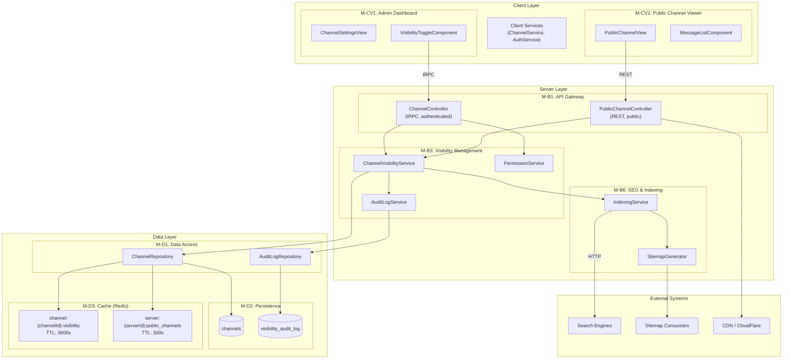
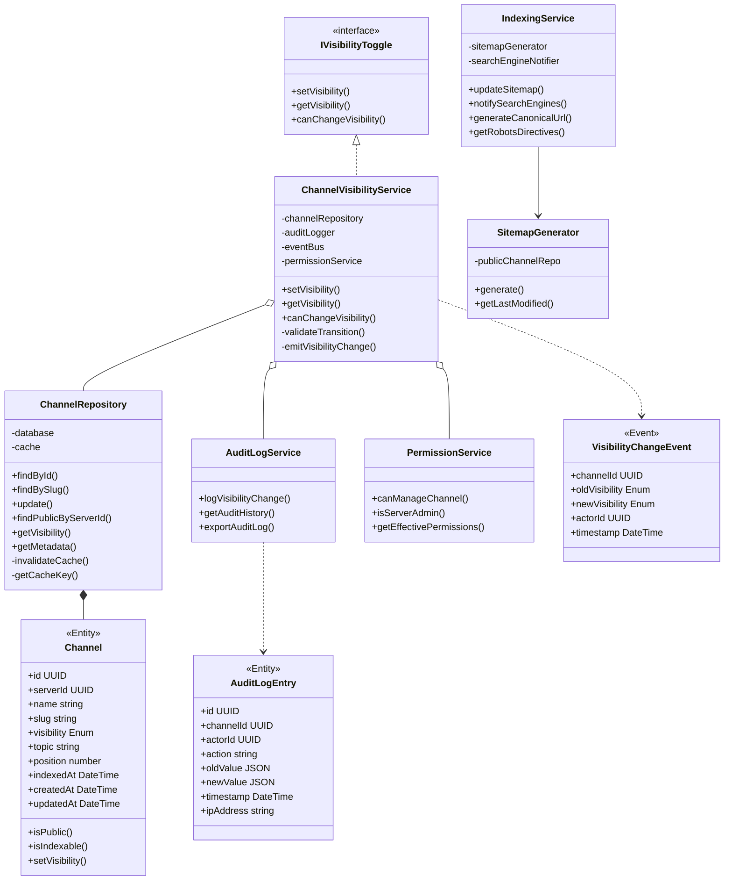
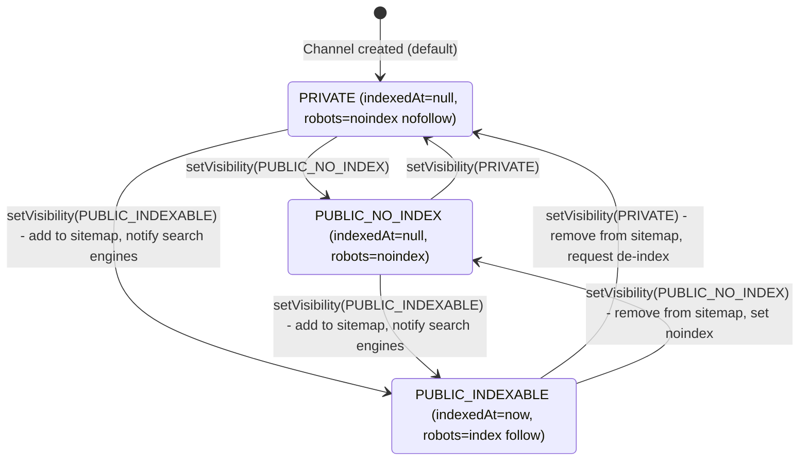
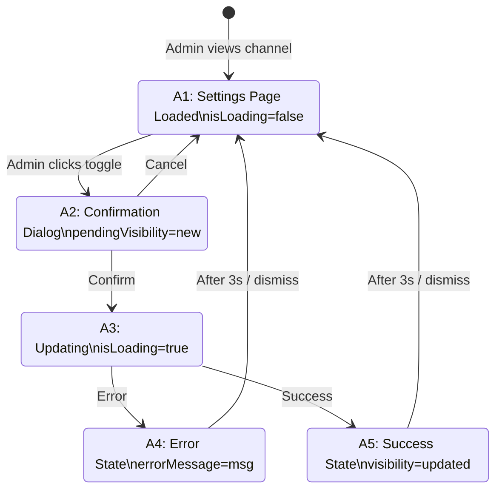
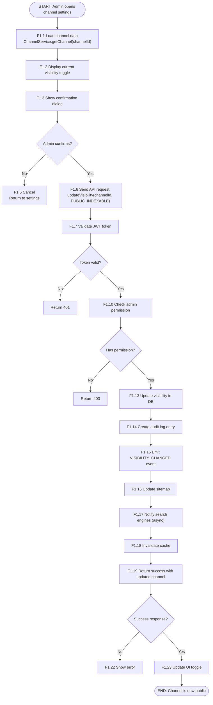
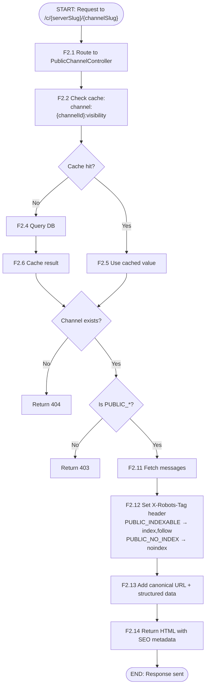
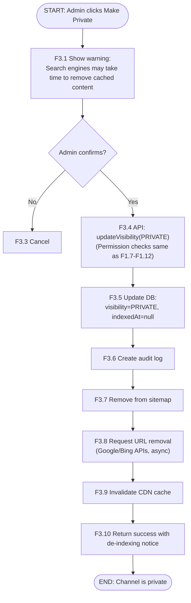
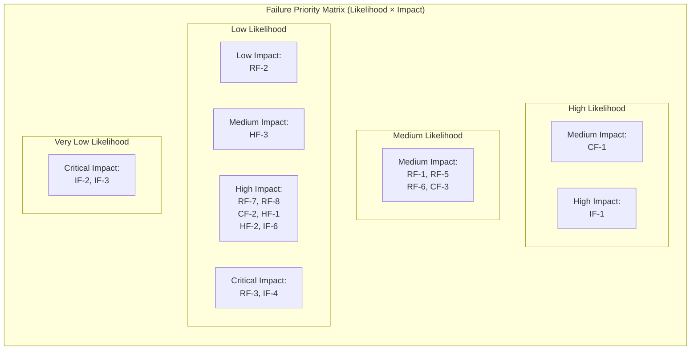

# Development Specification: Channel Visibility Toggle

## Feature: Public/Indexable Channel Control

**User Story:** As a Community Administrator, I want to toggle specific channels as "Public/Indexable" or "Private," so that I can control which parts of my community are exposed to the open web while keeping sensitive social conversations private.

> **Unified Backend Reference:** This feature's backend classes are part of the shared Harmony backend defined in [`unified-backend-architecture.md`](./unified-backend-architecture.md). The mapping from this spec's class labels to the unified module labels is in §10 of that document. Key modules contributed by this feature: **M-B3** (Visibility Management), **M-B6** (SEO & Indexing, shared), **M-D1** (Data Access, shared).

---

## 1. Header

### 1.1 Version and Date

| Version | Date       | Description                              |
|---------|------------|------------------------------------------|
| 1.0     | 2026-02-12 | Initial development specification        |
| 2.0     | 2026-02-12 | Cross-spec consolidation and fixes       |

### 1.2 Author and Role

| Author        | Role                    | Version |
|---------------|-------------------------|---------|
| Claude (AI)   | Specification Author    | 2.0     |
| dblanc        | Project Lead            | 1.0     |
| AvanishKulkarni | Project Lead | 2.0 |

### 1.3 Rationale
Header with versioning and authors.

---

## 2. Architecture Diagram

### 2.1 System Overview



> **Note:** All cache keys use UUID-based identifiers (e.g., `channel:{channelId}:visibility`) for consistency across all Harmony specs.

### 2.2 Information Flow Summary

| Flow ID | Source | Destination | Data | Protocol |
|---------|--------|-------------|------|----------|
| F1 | C1.2 VisibilityToggle | C4.1 ChannelController | VisibilityUpdateRequest | HTTPS (tRPC) |
| F2 | C4.1 ChannelController | C5.1 VisibilityService | VisibilityChangeCommand | Internal Call |
| F3 | C5.1 VisibilityService | C6.1 ChannelRepository | Channel Entity | Database Protocol |
| F4 | C5.1 VisibilityService | C5.2 IndexingService | IndexingEvent | EventBus (Redis Pub/Sub) |
| F5 | C5.2 IndexingService | E1 Search Engines | Sitemap XML | HTTPS |
| F6 | C4.2 PublicAccessCtrl | E3 CDN | Cached Public Content | HTTPS |
| F7 | C5.1 VisibilityService | C5.4 AuditLogService | AuditEntry | Internal Call |

### 2.3 Rationale

This follows a clear model-view-controller architecture, where the client can view channels and control their visibility state with the M1 Admin Dashboard controller. The underlying model is represented by the server layer, which handles get/set operations and any necessary side-effects for search engine indexing. 

The underlying data layer uses a short-term caching layer to reduce database accesses and syncs with external systems. 

We had to prompt edits to this to ensure the database columns were not mismatched across each architecture diagram. The Redis cache key pattern was also inconsistent across specs, so we had to prompt fixes for that as well.

---

## 3. Class Diagram



> **Sitemap Ownership:** `IndexingService` (CL6.1 / C5.2) is the canonical owner of sitemap generation and search engine notification across all Harmony specs. Other features (e.g., SEO Meta Tag Generation) emit events that this service consumes to trigger sitemap updates.

### 3.1 Rationale

After having an LLM review this spec, the canonical owner of the sitemap generation should be the IndexingService. There was a discrepancy between this spec and the seo-meta-tag-generation spec on what would consume server updates and generate new sitemaps for external services. 

Significant inconsistencies existed between section 2, 3, 9, and 10, so a verification pass was necessary after the document was generated to fix them. 

---

## 4. List of Classes

### 4.1 Client Module (M1, M2, M3)

| Label | Class Name | Type | Purpose |
|-------|------------|------|---------|
| CL-C1.1 | ChannelSettingsView | View Component | Channel settings page with visibility management |
| CL-C1.2 | VisibilityToggleComponent | UI Component | Toggle control for Public/Indexable ↔ Private with confirmation |
| CL-C2.1 | PublicChannelView | View Component | Public channel content for anonymous users and crawlers |
| CL-C2.2 | MessageListComponent | UI Component | Paginated message list with SEO-optimized markup |
| CL-C3.1 | ChannelService | Service | Client-side channel API calls including visibility updates |
| CL-C3.2 | AuthService | Service | Authentication state and permission checking |

### 4.2 API Gateway Module (M4)

| Label | Class Name | Type | Purpose |
|-------|------------|------|---------|
| CL-C4.1 | ChannelController | Controller | Authenticated channel management API (tRPC) |
| CL-C4.2 | PublicAccessController | Controller | Unauthenticated public content and sitemaps (REST) |

### 4.3 Business Logic Module (M5)

| Label | Class Name | Type | Purpose |
|-------|------------|------|---------|
| CL-C5.1 | ChannelVisibilityService | Service | Visibility state changes, validation, and event emission |
| CL-C5.2 | IndexingService | Service | Sitemap generation, crawler notifications (canonical owner) |
| CL-C5.3 | PermissionService | Service | User permission validation for channel management |
| CL-C5.4 | AuditLogService | Service | Audit trail for visibility changes |

### 4.4 Data Access Module (M6)

| Label | Class Name | Type | Purpose |
|-------|------------|------|---------|
| CL-C6.1 | ChannelRepository | Repository | Channel data access with caching |
| CL-C6.2 | AuditLogRepository | Repository | Audit log data access |

### 4.5 Data Structures (Entities/DTOs)

| Label | Class Name | Type | Purpose |
|-------|------------|------|---------|
| CL-D1 | Channel | Entity | Domain entity representing a channel with visibility state |
| CL-D2 | AuditLogEntry | Entity | Single audit log record |
| CL-D3 | VisibilityChangeEvent | Event | Event emitted on visibility changes |
| CL-D4 | ChannelVisibility | Enumeration | Possible visibility states |
| CL-D5 | VisibilityUpdateRequest | DTO | Request payload for visibility update |
| CL-D6 | VisibilityUpdateResponse | DTO | Response payload for visibility update |
| CL-D7 | PublicChannelDTO | DTO | Public-facing channel data (see §4.6) |

### 4.6 PublicChannelDTO Fields

```typescript
interface PublicChannelDTO {
  id: string;           // Channel UUID
  name: string;         // Display name
  slug: string;         // URL-safe identifier
  topic: string;        // Channel topic/description
  messageCount: number; // Total messages in channel
  serverSlug: string;   // Parent server's slug
}
```

### 4.7 Rationale

Like the previous section, I had to reprompt to fix inconsistencies. The LLM also noticed that the ChannelRepository interface/class has discrepancies across each spec, so it consolidated each of them together. The class diagrams correctly display the interactions between each class, so no update was needed there. 

---

## 5. State Diagrams

### 5.1 System State Variables

| Variable | Type | Description |
|----------|------|-------------|
| channel.visibility | ChannelVisibility | Current visibility state |
| channel.indexedAt | DateTime | Last sitemap inclusion timestamp |
| sitemap.lastModified | DateTime | Last sitemap update |
| auditLog.entries | AuditLogEntry[] | Audit records |

### 5.2 Channel Visibility State Machine



### 5.3 Admin Action State Diagram



### 5.4 Rationale

The first diagram correctly tracks the state changes for all possible channel states. No changes or reprompting the LLM was necessary for this section. The channel will be public, public & indexable, or private. A simplification of the roles-based access control in Discord, but covers the general idea. 

The second diagram correctly tracks the state transitions for the channel visibility permission. It is quite simple so the model did not need to the reprompted for any changes.

---

## 6. Flow Charts

### 6.1 Scenario: Admin Sets Channel to Public/Indexable

Admin navigates to channel settings and toggles a private channel to publicly indexable. System validates permissions, updates DB, regenerates sitemap, and notifies search engines.



#### 6.1.1 Cross-Spec Integration: Visibility → PUBLIC_INDEXABLE

When visibility changes to `PUBLIC_INDEXABLE`:
1. Emit `VISIBILITY_CHANGED` event via EventBus (Redis Pub/Sub)
2. **SEO Meta Tag Generation spec** consumes event → generates meta tags for the channel
3. **Guest Public Channel View spec** consumes event → warms guest view cache

### 6.2 Scenario: Anonymous User Views Public Channel

An anonymous user or crawler requests a public channel page. System verifies visibility and serves content with appropriate SEO headers.



### 6.3 Scenario: Admin Sets Channel to Private (De-indexing)

Administrator changes a public/indexable channel back to private. System removes from sitemap and requests de-indexing.



#### 6.3.1 Cross-Spec Integration: Visibility → PRIVATE

When visibility changes to `PRIVATE`:
1. Emit `VISIBILITY_CHANGED` event via EventBus (Redis Pub/Sub)
2. **SEO Meta Tag Generation spec** consumes event → deletes meta tags for the channel
3. **Guest Public Channel View spec** consumes event → invalidates guest view cache

---

### 6.4 Rationale

The LLM had to be reprompted here to clarify which protocols (RPC vs REST) would be used for communications. This was an issue across the this whole dev spec. It was determined REST protocols would be used for public APIs and RPC for internal communications. 

The LLM also had to be reprompted to finalize what the event bus would be. It chose Redis Pub/Sub to allow for visibility change updates to propagate. The cache keying also needed to be updated to match earlier updates. 

## 7. Development Risks and Failures

### 7.1 Runtime Failures

| Label | Failure Mode | User-Visible Effect | Recovery Procedure | Likelihood | Impact |
|-------|-------------|--------------------|--------------------|------------|--------|
| RF-1 | API Server crash | Toggle action fails | Auto-restart; client retries | Medium | Medium |
| RF-2 | Lost runtime state | Stale visibility displayed | Cache invalidation on recovery | Low | Low |
| RF-3 | Database corruption | Incorrect visibility; privacy breach | Restore from backup; audit reconciliation | Very Low | Critical |
| RF-4 | Invalid state transition | Channel may become public unintentionally | Server-side transition validation | Low | High |
| RF-5 | RPC failure | "Network error" shown | Retry with exponential backoff; circuit breaker | Medium | Medium |
| RF-6 | Server overload | Slow response or timeout | Rate limiting; horizontal scaling | Medium | Medium |
| RF-7 | Out of RAM | Server unresponsive | Memory limits; vertical scaling | Low | High |
| RF-8 | Database out of space | Write operations fail | Storage alerts; archive old audit logs | Low | High |

### 7.2 Connectivity Failures

| Label | Failure Mode | User-Visible Effect | Recovery Procedure | Likelihood | Impact |
|-------|-------------|--------------------|--------------------|------------|--------|
| CF-1 | Lost network | "Connection lost" banner | Auto-reconnect with backoff | Medium | Medium |
| CF-2 | Lost DB connection | API returns 503 | Connection pool health checks; failover | Low | High |
| CF-3 | Traffic spike | Increased latency | CDN caching; auto-scaling | Medium | Medium |
| CF-4 | Search engine API down | Indexing updates delayed | Queue failed notifications; retry | Medium | Low |

### 7.3 Hardware Failures

| Label | Failure Mode | User-Visible Effect | Recovery Procedure | Likelihood | Impact |
|-------|-------------|--------------------|--------------------|------------|--------|
| HF-1 | App server down | Service unavailable | Multi-AZ deployment; LB health checks | Low | High |
| HF-2 | Bad config loaded | Unpredictable behavior | Config validation on startup; rollback | Low | High |
| HF-3 | System relocation | Temporary outage | Blue-green deployment; DNS TTL management | Very Low | Medium |

### 7.4 Security Failures

| Label | Failure Mode | User-Visible Effect | Recovery Procedure | Likelihood | Impact |
|-------|-------------|--------------------|--------------------|------------|--------|
| IF-1 | DDoS attack | Service degradation | CloudFlare DDoS protection; rate limiting | Medium | High |
| IF-2 | OS compromise | Full system breach | Incident response; rebuild from clean images | Very Low | Critical |
| IF-3 | Code tampering | Malicious behavior | Code signing; integrity monitoring | Very Low | Critical |
| IF-4 | Database theft | Privacy breach | Encryption at rest; access logging | Low | Critical |
| IF-5 | Bot spam | Public channels flooded | CAPTCHA; rate limiting; content moderation | Medium | Medium |
| IF-6 | Session hijacking | Unauthorized changes | Secure cookies; session binding; anomaly detection | Low | High |

### 7.5 Failure Priority Matrix



### 7.6 Rationale

Minor reprompting was needed to standardize the rate-limiting policy. It did not affect this section, but other specs mentioned rate-limiting so it had to be added to this one as a failure. Otherwise the failure modes and resolutions make sense, and there are no obvious gaps in errors.

---

## 8. Technology Stack

| Label | Technology | Version | Purpose | Source |
|-------|------------|---------|---------|-------|
| T1 | TypeScript | 5.3+ | Primary language (client + server) | https://www.typescriptlang.org/ |
| T2 | React | 18.2+ | Frontend UI framework | https://react.dev/ |
| T3 | Next.js | 14.0+ | SSR/SSG framework (SEO-critical for public pages) | https://nextjs.org/ |
| T4 | Node.js | 20 LTS | Server runtime | https://nodejs.org/ |
| T5 | PostgreSQL | 16+ | Primary database (ACID, JSONB, enums) | https://www.postgresql.org/ |
| T6 | Redis | 7.2+ | Caching, session storage, EventBus (Pub/Sub) | https://redis.io/ |
| T7 | Prisma | 5.8+ | Type-safe ORM with migrations | https://www.prisma.io/ |
| T8 | tRPC | 10.45+ | End-to-end typesafe APIs (authenticated internal) | https://trpc.io/ |
| T9 | Zod | 3.22+ | Runtime schema validation (integrates with tRPC) | https://zod.dev/ |
| T10 | TailwindCSS | 3.4+ | Utility-first CSS framework | https://tailwindcss.com/ |
| T11 | CloudFlare | N/A | CDN and DDoS protection | https://www.cloudflare.com/ |
| T12 | Docker | 24+ | Containerization | https://www.docker.com/ |
| T13 | Google Search Console API | v1 | Programmatic indexing/de-indexing | https://developers.google.com/webmaster-tools |
| T14 | Bing Webmaster API | v1 | Microsoft search engine integration | https://www.bing.com/webmasters |
| T15 | Jest | 29+ | Unit/integration testing | https://jestjs.io/ |
| T16 | Playwright | 1.40+ | Cross-browser E2E testing | https://playwright.dev/ |
| T17 | sanitize-html | 2.12+ | XSS prevention / HTML sanitization for public-facing content (Node.js-native) | https://github.com/apostrophecms/sanitize-html |

> **Convention:** tRPC is used for authenticated internal APIs between client and server. Public-facing endpoints (sitemaps, public channel pages, robots.txt) use REST for maximum compatibility with crawlers and third-party consumers.

### 8.1 EventBus

**Technology:** Redis Pub/Sub (T6)

Event types consumed/produced across specs:

| Event | Source Spec | Description |
|-------|-------------|-------------|
| `VISIBILITY_CHANGED` | Channel Visibility Toggle (this spec) | Emitted when channel visibility state changes |
| `MESSAGE_CREATED` | SEO Meta Tag Generation | New message in a public channel |
| `MESSAGE_EDITED` | SEO Meta Tag Generation | Message edited in a public channel |
| `MESSAGE_DELETED` | SEO Meta Tag Generation | Message deleted from a public channel |
| `META_TAGS_UPDATED` | SEO Meta Tag Generation | Meta tags regenerated for a channel |

### 8.2 Rationale

Significant reprompting was necessary here because of conflicting tech stacks across each spec. This spec was missing DOMPurify, which would be needed to sanitize and generate sitemaps with other public content. The communication APIs being a mix of RPC and REST was also detected by the LLM here, requiring prompting to fix it. The LLM then determined to use RPC for authenticated internal APIs, while public endpoints would be REST for compatibility with web indexers.

Finally, the LLM made a shared tech-stack document that would be used across each spec. 

---

## 9. APIs

### 9.1 Module M4: API Gateway

#### 9.1.1 CL-C4.1 ChannelController

**Public Methods (Authenticated, tRPC):**

```typescript
// Get channel settings including visibility
getChannelSettings(
  channelId: string,          // UUID
  context: AuthenticatedContext
): Promise<ChannelSettingsResponse>

// Update channel visibility
updateChannelVisibility(
  channelId: string,
  body: VisibilityUpdateRequest,  // { visibility: ChannelVisibility }
  context: AuthenticatedContext
): Promise<VisibilityUpdateResponse>

// Get visibility change audit history
getVisibilityAuditLog(
  channelId: string,
  query: AuditLogQuery,       // { limit?, offset?, startDate? }
  context: AuthenticatedContext
): Promise<AuditLogResponse>
```

**Private Methods:**

```typescript
private validateAdminAccess(userId: string, channelId: string): Promise<boolean>
private mapToResponse(channel: Channel): ChannelSettingsResponse
```

#### 9.1.2 CL-C4.2 PublicAccessController

**Public Methods (Unauthenticated, REST):**

```typescript
// GET /c/{serverSlug}/{channelSlug}
getPublicChannel(
  serverSlug: string, channelSlug: string, query: PaginationQuery
): Promise<PublicChannelPage>

// GET /sitemap/{serverSlug}.xml
getServerSitemap(serverSlug: string): Promise<SitemapXML>

// GET /robots.txt
getRobotsTxt(): Promise<RobotsTxt>

// GET /api/public/channels/{channelId}/messages
getPublicMessages(channelId: string, query: PaginationQuery): Promise<PublicMessagesResponse>
```

### 9.2 Module M5: Business Logic

#### 9.2.1 CL-C5.1 ChannelVisibilityService

```typescript
// Set channel visibility with validation
setVisibility(
  channelId: string, newVisibility: ChannelVisibility,
  actorId: string, ipAddress: string
): Promise<VisibilityChangeResult>

getVisibility(channelId: string): Promise<ChannelVisibility>
canChangeVisibility(channelId: string, actorId: string): Promise<boolean>

private validateTransition(
  current: ChannelVisibility, next: ChannelVisibility
): ValidationResult

private emitVisibilityChange(event: VisibilityChangeEvent): Promise<void>
```

#### 9.2.2 CL-C5.2 IndexingService

```typescript
updateSitemap(serverId: string): Promise<void>
notifySearchEngines(url: string, action: 'INDEX' | 'REMOVE'): Promise<NotificationResult>
generateCanonicalUrl(serverId: string, channelId: string): string
getRobotsDirectives(visibility: ChannelVisibility): RobotsDirectives
```

#### 9.2.3 CL-C5.3 PermissionService

```typescript
canManageChannel(userId: string, channelId: string): Promise<boolean>
isServerAdmin(userId: string, serverId: string): Promise<boolean>
getEffectivePermissions(userId: string, channelId: string): Promise<PermissionSet>
```

#### 9.2.4 CL-C5.4 AuditLogService

```typescript
logVisibilityChange(entry: AuditLogEntry): Promise<void>
getAuditHistory(channelId: string, options: AuditQueryOptions): Promise<AuditLogEntry[]>
exportAuditLog(channelId: string, format: 'JSON' | 'CSV'): Promise<Buffer>
```

### 9.3 Module M6: Data Access

#### 9.3.1 CL-C6.1 ChannelRepository (Consolidated)

```typescript
findById(channelId: string): Promise<Channel | null>
findBySlug(serverSlug: string, channelSlug: string): Promise<Channel | null>
update(channelId: string, data: Partial<Channel>): Promise<Channel>
findPublicByServerId(serverId: string): Promise<Channel[]>
getVisibility(channelId: string): Promise<ChannelVisibility>
getMetadata(channelId: string): Promise<ChannelMetadata>

private invalidateCache(channelId: string): Promise<void>
private getCacheKey(channelId: string): string
```

### 9.4 Rate Limiting

| Consumer Type | Limit | Window | Scope |
|---------------|-------|--------|-------|
| Human users (authenticated) | 100 req | 1 min | Per user |
| Verified bots / crawlers | 1000 req | 1 min | Per bot identity |

Rate limits apply to all API endpoints. Exceeding limits returns `429 Too Many Requests` with `Retry-After` header.

### 9.5 Rationale

The LLM had generated mismatched class methods and variables from before and now. It had to be reprompted to recouncile the differences and create missing functions both here and in previous sections. Like mentioned before, it also had to be reprompted to standardize a ratelimiting policy here instead of arbitrary values elsewhere.

The separation of public APIs, business logic, and data access layers is good practice in large systems, so I agree with the LLM's decisions here.

---

## 10. Public Interfaces

### 10.1 Cross-Module Interfaces

#### Client (M1–M3) → API Gateway (M4):

| Method | Class | Used For |
|--------|-------|----------|
| getChannelSettings() | ChannelController | Loading channel settings |
| updateChannelVisibility() | ChannelController | Visibility toggle |
| getVisibilityAuditLog() | ChannelController | Audit history display |
| getPublicChannel() | PublicAccessController | Viewing public channel |
| getPublicMessages() | PublicAccessController | Paginating public messages |

#### API Gateway (M4) → Business Logic (M5):

| Method | Class | Used For |
|--------|-------|----------|
| setVisibility() | ChannelVisibilityService | Processing visibility updates |
| getVisibility() | ChannelVisibilityService | Reading current visibility |
| canChangeVisibility() | ChannelVisibilityService | Permission checking |
| canManageChannel() | PermissionService | Authorization |
| generateCanonicalUrl() | IndexingService | SEO headers |
| getRobotsDirectives() | IndexingService | SEO headers |
| getAuditHistory() | AuditLogService | Audit log endpoint |

#### Business Logic (M5) → Data Access (M6):

| Method | Class | Used For |
|--------|-------|----------|
| findById() | ChannelRepository | Loading channel entity |
| findBySlug() | ChannelRepository | Slug-based channel lookup |
| update() | ChannelRepository | Persisting visibility changes |
| findPublicByServerId() | ChannelRepository | Sitemap generation |
| getVisibility() | ChannelRepository | Fast visibility check |
| getMetadata() | ChannelRepository | Channel metadata retrieval |
| create() | AuditLogRepository | Writing audit entries |
| findByChannelId() | AuditLogRepository | Reading audit history |

### 10.2 REST API Interface

```yaml
openapi: 3.0.3
info:
  title: Harmony Channel Visibility API
  version: 1.0.0

paths:
  /api/channels/{channelId}/visibility:
    patch:
      summary: Update channel visibility
      security:
        - bearerAuth: []
      parameters:
        - name: channelId
          in: path
          required: true
          schema:
            type: string
            format: uuid
      requestBody:
        required: true
        content:
          application/json:
            schema:
              $ref: '#/components/schemas/VisibilityUpdateRequest'
      responses:
        '200':
          description: Visibility updated
          content:
            application/json:
              schema:
                $ref: '#/components/schemas/VisibilityUpdateResponse'
        '401':
          description: Unauthorized
        '403':
          description: Forbidden
        '404':
          description: Channel not found
        '429':
          description: Rate limit exceeded

components:
  schemas:
    ChannelVisibility:
      type: string
      enum: [PUBLIC_INDEXABLE, PUBLIC_NO_INDEX, PRIVATE]

    VisibilityUpdateRequest:
      type: object
      required: [visibility]
      properties:
        visibility:
          $ref: '#/components/schemas/ChannelVisibility'

    VisibilityUpdateResponse:
      type: object
      properties:
        success:
          type: boolean
        channel:
          $ref: '#/components/schemas/ChannelDTO'
        previousVisibility:
          $ref: '#/components/schemas/ChannelVisibility'
        indexingStatus:
          type: string
          enum: [PENDING, INDEXED, NOT_INDEXED, REMOVAL_REQUESTED]
```

### 10.3 Cross-Spec Event Integration

When `VISIBILITY_CHANGED` is emitted:

| New Visibility | Downstream Action (SEO Spec) | Downstream Action (Guest View Spec) |
|---------------|------------------------------|--------------------------------------|
| `PUBLIC_INDEXABLE` | Generate meta tags for channel | Warm guest view cache |
| `PUBLIC_NO_INDEX` | Update meta tags (add noindex) | Keep guest view cache (public content) |
| `PRIVATE` | Delete meta tags for channel | Invalidate guest view cache |

### 10.4 Rationale

The LLM correctly generated the public API specification. It did not need to be reprompted for any fixes here. The generated API specification is correct and exposes the endpoints necessary for this specific user story. 

Significant inconsistencies in classes existed between sections 2, 3, 9, and 10, so a verification pass was necessary after the document was generated to fix them. 

---

## 11. Data Schemas

### 11.1 Database Tables

#### D7.1 channels

**Runtime Class:** CL-D1 Channel

| Column | Database Type | Constraints | Description |
|--------|--------------|-------------|-------------|
| id | UUID | PRIMARY KEY | Unique channel identifier |
| server_id | UUID | FOREIGN KEY → servers(id), NOT NULL, INDEX | Parent server reference |
| name | VARCHAR(100) | NOT NULL | Display name |
| slug | VARCHAR(100) | NOT NULL, UNIQUE per server | URL-safe identifier |
| visibility | visibility_enum | NOT NULL, DEFAULT 'PRIVATE' | Current visibility state |
| topic | TEXT | NULL | Channel topic/description |
| position | INTEGER | NOT NULL, DEFAULT 0 | Display order within server |
| indexed_at | TIMESTAMP WITH TIME ZONE | NULL | When channel was added to sitemap |
| created_at | TIMESTAMP WITH TIME ZONE | NOT NULL, DEFAULT NOW() | Creation timestamp |
| updated_at | TIMESTAMP WITH TIME ZONE | NOT NULL, DEFAULT NOW() | Last modification timestamp |

**Enum Definition:**
```sql
CREATE TYPE visibility_enum AS ENUM ('PUBLIC_INDEXABLE', 'PUBLIC_NO_INDEX', 'PRIVATE');
```

**Indexes (Canonical Set — merged from all specs):**
```sql
-- Composite index for server-scoped visibility queries
CREATE INDEX idx_channels_server_visibility ON channels(server_id, visibility);

-- Unique slug per server
CREATE UNIQUE INDEX idx_channels_server_slug ON channels(server_id, slug);

-- Partial index for indexable channels (sitemap generation)
CREATE INDEX idx_channels_visibility_indexed ON channels(visibility, indexed_at)
  WHERE visibility = 'PUBLIC_INDEXABLE';

-- Partial index for all public channels (guest view queries)
CREATE INDEX idx_channels_visibility ON channels(visibility)
  WHERE visibility IN ('PUBLIC_INDEXABLE', 'PUBLIC_NO_INDEX');
```

#### D7.2 visibility_audit_log

**Runtime Class:** CL-D2 AuditLogEntry

| Column | Database Type | Constraints | Description |
|--------|--------------|-------------|-------------|
| id | UUID | PRIMARY KEY | Unique log entry identifier |
| channel_id | UUID | FOREIGN KEY, NOT NULL, INDEX | Channel reference |
| actor_id | UUID | FOREIGN KEY, NOT NULL | User who made change |
| action | VARCHAR(50) | NOT NULL | e.g., 'VISIBILITY_CHANGED' |
| old_value | JSONB | NULL | Previous state |
| new_value | JSONB | NOT NULL | New state |
| timestamp | TIMESTAMP WITH TIME ZONE | NOT NULL, DEFAULT NOW(), INDEX | When action occurred |
| ip_address | INET | NULL | Actor's IP address |
| user_agent | VARCHAR(500) | NULL | Actor's browser/client |

**Indexes:**
```sql
CREATE INDEX idx_audit_channel_time ON visibility_audit_log(channel_id, timestamp DESC);
CREATE INDEX idx_audit_actor ON visibility_audit_log(actor_id, timestamp DESC);
```

**Retention Policy:** 7 years per compliance requirements.

#### D7.3 servers (Reference — canonical definition in Guest Public Channel View spec)

| Column | Database Type | Constraints |
|--------|--------------|-------------|
| id | UUID | PRIMARY KEY |
| name | VARCHAR(100) | NOT NULL |
| slug | VARCHAR(100) | UNIQUE |
| description | TEXT | NULL |
| icon_url | VARCHAR(500) | NULL |
| is_public | BOOLEAN | DEFAULT FALSE |
| member_count | INTEGER | DEFAULT 0 |
| created_at | TIMESTAMP WITH TIME ZONE | NOT NULL |

> This table is referenced by `channels.server_id`. See the Guest Public Channel View spec for the full canonical definition.

### 11.2 Cache Schemas

#### D8.1 ChannelVisibilityCache

- **Key Pattern:** `channel:{channelId}:visibility` (UUID-based)
- **Value:** String (visibility enum value)
- **TTL:** 3600s (1 hour)

#### D8.2 PublicChannelListCache

- **Key Pattern:** `server:{serverId}:public_channels`
- **Value:** JSON array of channel IDs
- **TTL:** 300s (5 minutes)

### 11.3 Field Type Mappings

| TypeScript Type | PostgreSQL Type | Notes |
|-----------------|-----------------|-------|
| string (UUID) | UUID | Native UUID type |
| ChannelVisibility (enum) | visibility_enum | PostgreSQL enum |
| Date | TIMESTAMP WITH TIME ZONE | Always UTC |
| object (audit values) | JSONB | Flexible schema |
| string (IP) | INET | Supports IPv4/IPv6 |

### 11.4 Rationale

This section needed significant reprompting due to database schema and index mismatches across all specs. Beyond that, the architecture is justified because it provides unique mappings for all (server, channel) pairs, allowing for indexers to access them consistently for updates. 

Cache schemas and keys needed reprompting to fix issues with inconsistent keying. 

---

## 12. Security and Privacy

### 12.1 Temporarily Stored PII

| PII Type | Justification | Usage | Disposal | Protection |
|----------|---------------|-------|----------|------------|
| IP Address | Audit trail | Logged with visibility changes | Retained in audit log | TLS in transit; encrypted at rest |
| User Agent | Identifying suspicious activity | Logged with visibility changes | Retained in audit log | TLS in transit; encrypted at rest |
| Session Token | Authentication | Validate user identity | Not stored (stateless JWT) | TLS only; short expiry |

### 12.2 Long-Term Stored PII

| PII Type | Justification | Storage Location | Access Path |
|----------|---------------|------------------|-------------|
| Actor ID (→ User) | Accountability for admin actions | D7.2 visibility_audit_log.actor_id | AuditLogRepository → AuditLogService → ChannelController |
| IP Address | Security investigation, abuse prevention | D7.2 visibility_audit_log.ip_address | Only via audit log export by authorized personnel |

### 12.3 Data Protection Measures

- **In transit:** TLS 1.3
- **At rest:** AES-256 database encryption; separate backup encryption keys
- **Access:** Audit log restricted to Security Officer role; DB credentials rotated quarterly; least privilege for service accounts

### 12.4 Privacy Policy

**Customer-Visible Points:**
- Public channels are visible to anyone on the internet, including search engines
- Messages in public channels may appear in search results
- Administrators can change channel visibility at any time
- Previously indexed content may remain in search engine caches after being made private

**Policy Presentation:** Warning on channel creation; confirmation dialog on public toggle; de-indexing notice on private toggle.

### 12.5 Access Policies

| Role | Visibility Change | View Audit Log | Export Audit Log |
|------|-------------------|----------------|------------------|
| Server Owner | Yes | Yes | Yes |
| Server Administrator | Yes | Yes | No |
| Channel Moderator | No | No | No |
| Regular Member | No | No | No |
| Anonymous User | No | No | No |

### 12.6 Audit Procedures

**Routine:** All API requests logged (timestamp, actor, action). Audit log queries are themselves logged. Monthly review of access patterns.

**Non-Routine:** Break-glass requires two-person approval. Emergency access reviewed within 24 hours. Incident reports for anomalies.

### 12.7 Minor Protection

Platform requires 13+ (COPPA). No specific minor PII collection beyond standard account data. Public channels may contain minor-posted content; parents/guardians agree to terms.

### 12.8 Security Responsibilities

| Storage/System | Responsible | Backup |
|----------------|-------------|--------|
| PostgreSQL Database | Database Administrator | DevOps Lead |
| Redis Cache | DevOps Lead | Database Administrator |
| Audit Log Storage | Security Officer | Compliance Manager |

### 12.9 XSS Prevention

All public-facing content (public channel pages, sitemap entries, PublicChannelDTO fields) is sanitized using sanitize-html (T17) before rendering to prevent XSS attacks from user-generated content.

### 12.10 Rationale

The LLM did not have issues with generating security and privacy requirements. This architecture is justified because it creates an audit trail for any actions. All actions are tagged by the user doing the action. IP addresses are also stored for audits. 

Visibility rules and search indexing is also handled with the appropriate care needed for making channels publically indexable. 

---

## 13. Risks to Completion

### 13.1 Technology Risks

| Technology | Learning Curve | Implementation Difficulty | Maintenance | Update Strategy |
|------------|----------------|---------------------------|-------------|-----------------|
| T1: TypeScript | Low | Low | Low | Dependabot |
| T2: React | Low | Low | Low | React upgrade guides |
| T3: Next.js | Medium (SSR) | Medium | Medium | Vercel migration guides |
| T5: PostgreSQL | Low | Low | Low | Standard upgrade path |
| T6: Redis | Low | Low | Low | Standard upgrade path |
| T7: Prisma | Medium | Low | Low | Migration tooling |
| T8: tRPC | Medium (new) | Medium | Medium | Breaking changes documented |
| T13/T14: Search APIs | High (external) | High | High | Monitor deprecation notices |

### 13.2 Component Risks

| Component | Risk Factor | Mitigation |
|-----------|-------------|------------|
| M5.2 IndexingService | External API dependencies may change | Abstraction layer; graceful degradation |
| M4.2 PublicAccessCtrl | High crawler traffic | CDN caching; rate limiting; edge computing |
| M6.1 ChannelRepository | Cache invalidation complexity | Explicit invalidation; short TTLs |
| D7.2 AuditLogTable | Storage growth | Date partitioning; archival; retention policy |

### 13.3 Off-the-Shelf Software

| Technology | Customization | Source Available | Bug/Security Fix | Cost |
|------------|--------------|------------------|------------------|------|
| PostgreSQL | None | Yes (OSS) | Community (fast) | Free |
| Redis | None | Yes (OSS) | Community (fast) | Free |
| Next.js | Minor (SSR config) | Yes (OSS) | Community | Free / Paid |
| Prisma | None | Yes (OSS) | Community | Free |
| CloudFlare | CDN rules | No (SaaS) | CloudFlare | Monthly fee |

### 13.4 Risk Prioritization

**High Priority:**
1. Search engine API integration — requires early prototyping
2. SSR performance for public pages — critical for SEO
3. Permission system accuracy — security critical

**Medium Priority:**
1. Audit log storage scaling
2. Cache invalidation correctness
3. CDN configuration

**Low Priority:**
1. UI polish for settings page
2. Audit log export formats

### 13.5 Contingency Plans

| Risk | Trigger | Contingency |
|------|---------|-------------|
| Search API unavailable | 3+ consecutive failures | Queue requests; manual sitemap submission; alert ops |
| DB performance degradation | p99 > 500ms | Read replicas; query plan review; add indexes |
| CDN issues | Cache hit rate < 80% | Increase origin capacity; review cache rules |
| Security breach | Unauthorized access | Incident response; notify users; rotate credentials |

### 13.6 Rationale

This set of risks is justified since the product will be a public facing chat client with many frequently updated libraries. No reprompting was necessary here. 

Component risks make sense, primarily external API changes and growing storage/bandwidth costs. These are common issues which the LLM caught and documented well. 

The LLM is justified in determining the cost of operation as well, figuring out what finanical risks are present in creating this software. 

Contingency plans and thresholds to activate them match industry standards for API, database, and caching failures. Therefore the LLM is justified in making these decisions.

---

## Appendix A: Glossary

| Term | Definition |
|------|------------|
| Indexable | Content that search engines are permitted to include in search results |
| Sitemap | XML file listing URLs for search engines to crawl |
| Canonical URL | Preferred URL for content accessible via multiple URLs |
| robots.txt | File instructing crawlers which URLs to access |
| X-Robots-Tag | HTTP header providing indexing instructions to crawlers |
| De-indexing | Requesting search engines remove content from their index |
| CDN | Content Delivery Network — geographically distributed caching servers |
| SSR | Server-Side Rendering — generating HTML on the server |
| PII | Personally Identifiable Information |
| EventBus | Redis Pub/Sub messaging layer for cross-service event communication |

---

## Appendix B: Document References

- User Story: Channel Visibility Toggle (this document)
- Dev Spec: SEO Meta Tag Generation (cross-referenced for event integration)
- Dev Spec: Guest Public Channel View (cross-referenced for `servers` table and cache warmup)
- Platform Architecture Overview (separate document)
- Harmony Security Policy (separate document)
- SEO Best Practices Guide (separate document)
