# P4 Backend Module Specifications — Harmony

This document provides the P4 specification for every backend module in the Harmony architecture, following the required format from the course project description.

> **Path shorthand:** All `backend/src/...` paths in the Code Generation sections refer to `harmony-backend/src/...` in the actual repository.

---

## Module 1: Authentication

### 1. Features

| Capability | Description |
|---|---|
| User registration | Creates a new account with email, username, and password. Validates email format, username (3–32 chars, alphanumeric + underscore/hyphen), and password (8–72 chars). |
| Login | Authenticates a user by email and password, returns an access token and a refresh token. Uses constant-time comparison to prevent timing attacks. |
| Token refresh | Rotates an existing refresh token into a new access/refresh pair. The old token is revoked atomically. |
| Logout | Revokes a single refresh token. |
| Rate limiting (planned) | Login: 10 attempts / 15 min. Registration: 5 attempts / hour (production). Not yet implemented — no rate-limiting middleware is present in `auth.router.ts`. |

**What it does not do:** This module does not handle OAuth/social login, multi-factor authentication, password reset flows, or session management beyond JWT tokens.

### 2. Internal Architecture

The Authentication module follows a stateless JWT pattern with server-side refresh-token revocation.

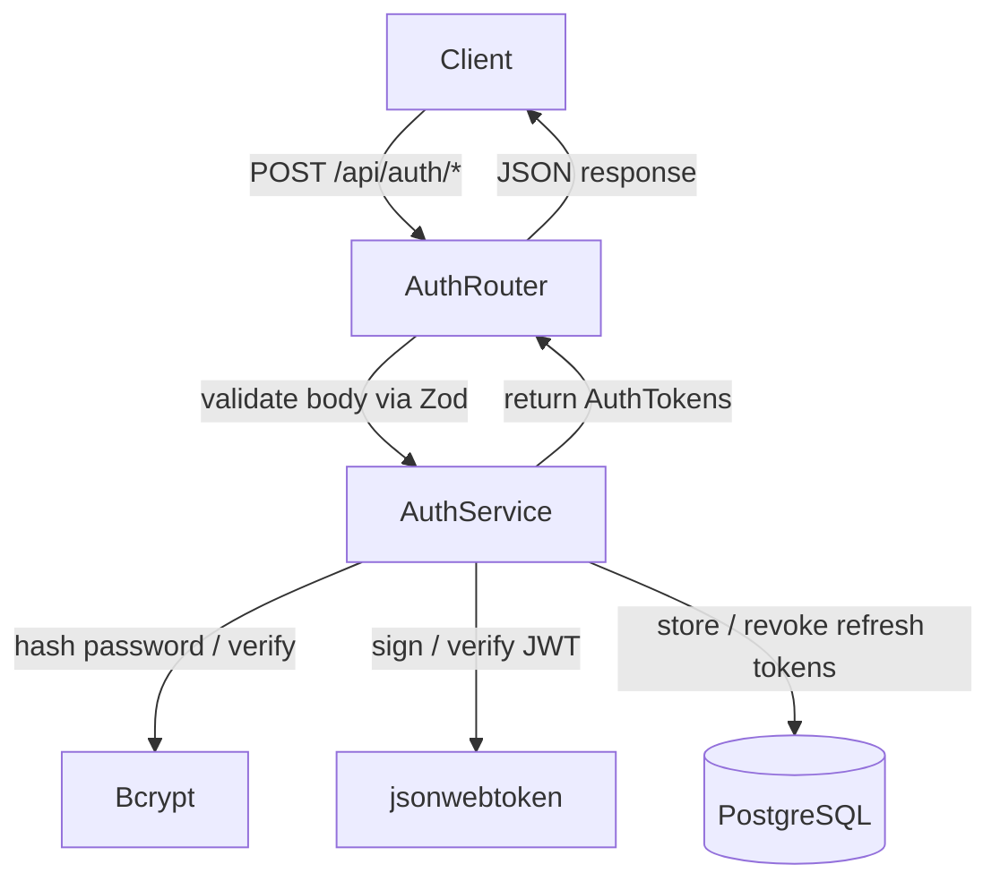
```mermaid
flowchart TD
    Client -->|POST /api/auth/*| AuthRouter
    AuthRouter -->|validate body via Zod| AuthService
    AuthService -->|hash password / verify| Bcrypt
    AuthService -->|sign / verify JWT| jsonwebtoken
    AuthService -->|store / revoke refresh tokens| Prisma[(PostgreSQL)]
    AuthService -->|return AuthTokens| AuthRouter
    AuthRouter -->|JSON response| Client
```

**Design justification:** Stateless access tokens (short-lived, 15 min) keep the API horizontally scalable — no shared session store is required for read requests. Refresh tokens are stored hashed in PostgreSQL so that token revocation is authoritative and survives server restarts. bcrypt with 12 rounds provides adequate brute-force resistance without excessive CPU cost at current scale.

### 3. Data Abstraction

The module's core abstraction is the **AuthTokens** pair:

- `accessToken` — a short-lived JWT (15 min) containing `{ sub: userId }`. Used by all other modules via the `requireAuth` middleware.
- `refreshToken` — a long-lived JWT (7 days) containing `{ sub: userId, jti: uniqueId }`. Stored as a SHA-256 hash in the database.

Internally, the module treats password hashes as opaque strings produced and consumed only by bcrypt. No plaintext passwords are ever persisted.

### 4. Stable Storage

Refresh tokens and user credentials are stored in PostgreSQL via Prisma.

**RefreshToken schema:**

```prisma
model RefreshToken {
  id        String    @id @default(uuid())
  tokenHash String    @unique
  userId    String
  expiresAt DateTime
  revokedAt DateTime?
  createdAt DateTime  @default(now())
  user      User      @relation(fields: [userId], references: [id])
}
```

**User credential fields** (subset of User model):

```prisma
model User {
  id           String @id @default(uuid())
  email        String @unique
  username     String @unique
  passwordHash String
  ...
}
```

### 5. External API

| Method | Endpoint | Request Body | Response | Auth |
|---|---|---|---|---|
| POST | `/api/auth/register` | `{ email, username, password }` | `{ accessToken, refreshToken }` | None |
| POST | `/api/auth/login` | `{ email, password }` | `{ accessToken, refreshToken }` | None |
| POST | `/api/auth/logout` | `{ refreshToken }` | `204 No Content` | None |
| POST | `/api/auth/refresh` | `{ refreshToken }` | `{ accessToken, refreshToken }` | None |

Error responses use standard HTTP codes: 400 (validation), 401 (bad credentials), 409 (duplicate email/username), 429 (rate limited).

### 6. Class/Method/Field Declarations

```typescript
// ── Public ──────────────────────────────────────────────

/** Returned by register, login, and refresh operations. */
interface AuthTokens {
  accessToken: string;
  refreshToken: string;
}

/** Decoded JWT payload. */
interface JwtPayload {
  sub: string;   // userId
  jti?: string;  // unique token ID (refresh tokens only)
}

export const authService = {
  register(email: string, username: string, password: string): Promise<AuthTokens>;
  login(email: string, password: string): Promise<AuthTokens>;
  logout(rawRefreshToken: string): Promise<void>;
  refreshTokens(rawRefreshToken: string): Promise<AuthTokens>;
  verifyAccessToken(token: string): JwtPayload;
};

/** Express middleware — attaches userId to req. */
export function requireAuth(req: Request, res: Response, next: NextFunction): void;

export interface AuthenticatedRequest extends Request {
  userId: string;
}

// Express router
export const authRouter: Router;

// ── Private (module-internal) ───────────────────────────

const BCRYPT_ROUNDS: 12;
const ACCESS_EXPIRES_IN: string;
const REFRESH_EXPIRES_IN_DAYS: number;

function signAccessToken(userId: string): string;
function signRefreshToken(userId: string): string;
function hashToken(token: string): string;
function storeRefreshToken(userId: string, rawToken: string): Promise<void>;
function ensureAdminUser(): Promise<User>;
```

### 7. Class Hierarchy Diagram

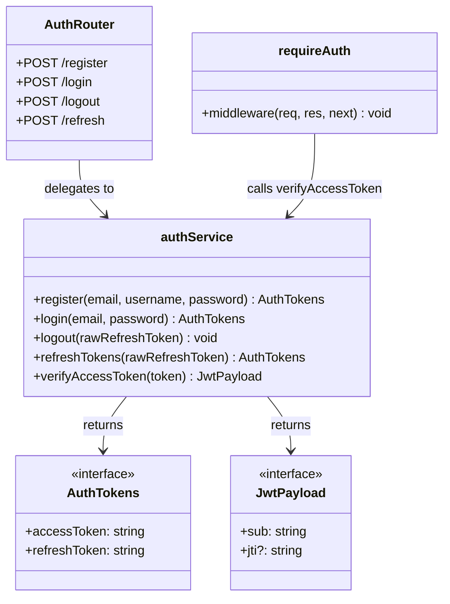
```mermaid
classDiagram
    class authService {
        +register(email, username, password) AuthTokens
        +login(email, password) AuthTokens
        +logout(rawRefreshToken) void
        +refreshTokens(rawRefreshToken) AuthTokens
        +verifyAccessToken(token) JwtPayload
    }

    class AuthRouter {
        +POST /register
        +POST /login
        +POST /logout
        +POST /refresh
    }

    class requireAuth {
        +middleware(req, res, next) void
    }

    class AuthTokens {
        <<interface>>
        +accessToken: string
        +refreshToken: string
    }

    class JwtPayload {
        <<interface>>
        +sub: string
        +jti?: string
    }

    AuthRouter --> authService : delegates to
    requireAuth --> authService : calls verifyAccessToken
    authService --> AuthTokens : returns
    authService --> JwtPayload : returns
```

### 8. Code Generation

Implementation code is located in:
- `backend/src/services/auth.service.ts` — core business logic
- `backend/src/routes/auth.router.ts` — Express route handler
- `backend/src/middleware/auth.middleware.ts` — JWT verification middleware

---

## Module 2: Server (Community) Management

### 1. Features

| Capability | Description |
|---|---|
| Create server | Creates a new community with a name, optional description, icon, and public/private flag. Auto-generates a unique URL slug. Creates a default `#general` text channel. |
| List servers | Returns all servers for system admins; returns only member servers for regular users. |
| Get server | Retrieves a single server by its URL slug. |
| Update server | Owner/admin can update name, description, icon, and public status. Slug is regenerated on name change. |
| Delete server | Owner-only. Cascading delete of all channels, messages, and memberships. |
| List members | Returns all members of a server with their roles and user profiles. |

**What it does not do:** Does not handle invitations, server bans, server templates, or server discovery beyond the public listing.

### 2. Internal Architecture

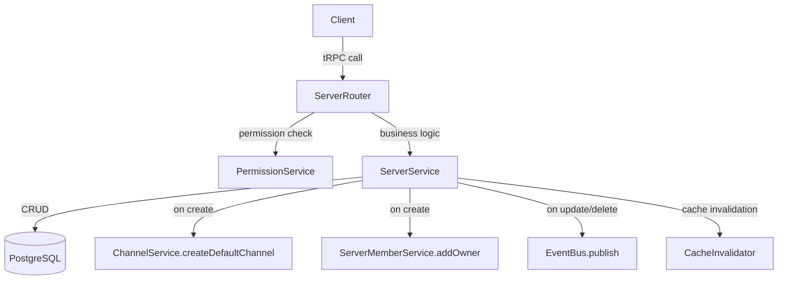
```mermaid
flowchart TD
    Client -->|tRPC call| ServerRouter
    ServerRouter -->|permission check| PermissionService
    ServerRouter -->|business logic| ServerService
    ServerService -->|CRUD| Prisma[(PostgreSQL)]
    ServerService -->|on create| ChannelService[ChannelService.createDefaultChannel]
    ServerService -->|on create| ServerMemberService[ServerMemberService.addOwner]
    ServerService -->|on update/delete| EventBus[EventBus.publish]
    ServerService -->|cache invalidation| CacheInvalidator
```

**Design justification:** Server creation is a multi-step operation (create server → create default channel → add owner as member) that runs in a Prisma transaction to maintain consistency. Slug generation uses a retry loop to handle collisions from concurrent creates. The `memberCount` field is denormalized on the Server model and atomically incremented/decremented to avoid expensive COUNT queries on the join table.

### 3. Data Abstraction

A **Server** represents a community workspace containing channels and members. Key invariants:
- Every server has exactly one owner (the creator).
- `slug` is unique and URL-safe, derived from `name`.
- `memberCount` is kept in sync with the `ServerMember` join table via `incrementMemberCount` / `decrementMemberCount`.

### 4. Stable Storage

```prisma
model Server {
  id          String   @id @default(uuid())
  name        String
  slug        String   @unique
  description String?
  iconUrl     String?
  isPublic    Boolean  @default(false)
  memberCount Int      @default(0)
  ownerId     String
  createdAt   DateTime @default(now())
  owner       User     @relation(fields: [ownerId], references: [id])
  channels    Channel[]
  members     ServerMember[]
}
```

### 5. External API

All endpoints require authentication via tRPC `authedProcedure` or `withPermission`.

| Procedure | Type | Input | Permission |
|---|---|---|---|
| `server.getServers` | query | `{ limit?: number }` | Authenticated |
| `server.getServer` | query | `{ slug: string }` | Authenticated |
| `server.createServer` | mutation | `{ name, description?, iconUrl?, isPublic? }` | Authenticated |
| `server.updateServer` | mutation | `{ id, name?, description?, iconUrl?, isPublic? }` | Authenticated (ownership verified internally) |
| `server.deleteServer` | mutation | `{ id }` | Authenticated (owner only) |
| `server.getMembers` | query | `{ serverId }` | `server:read` |

### 6. Class/Method/Field Declarations

```typescript
// ── Public ──────────────────────────────────────────────

export const serverService = {
  getPublicServers(limit?: number): Promise<Server[]>;
  getAllServers(limit?: number): Promise<Server[]>;
  getMemberServers(userId: string, limit?: number): Promise<Server[]>;
  getServer(slug: string): Promise<Server | null>;
  createServer(input: {
    name: string; description?: string; iconUrl?: string;
    isPublic?: boolean; ownerId: string;
  }): Promise<Server>;
  updateServer(id: string, actorId: string, data: {
    name?: string; description?: string; iconUrl?: string; isPublic?: boolean;
  }): Promise<Server>;
  deleteServer(id: string, actorId: string): Promise<Server>;
  incrementMemberCount(id: string): Promise<Server>;
  decrementMemberCount(id: string): Promise<Server>;
  getMembers(serverId: string): Promise<ServerMemberWithUser[]>;
};

interface ServerMemberWithUser {
  userId: string; serverId: string; role: string; joinedAt: Date;
  user: { id: string; username: string; displayName: string; avatarUrl: string | null; status: string };
}

export const serverRouter: tRPC.Router;

// ── Private ─────────────────────────────────────────────

const ROLE_RANK: Record<string, number>;
function generateSlug(name: string): string;
function generateUniqueSlug(name: string): Promise<string>;
function withSlugRetry(name: string, initialSlug: string, fn, maxRetries?): Promise<Server>;
```

### 7. Class Hierarchy Diagram

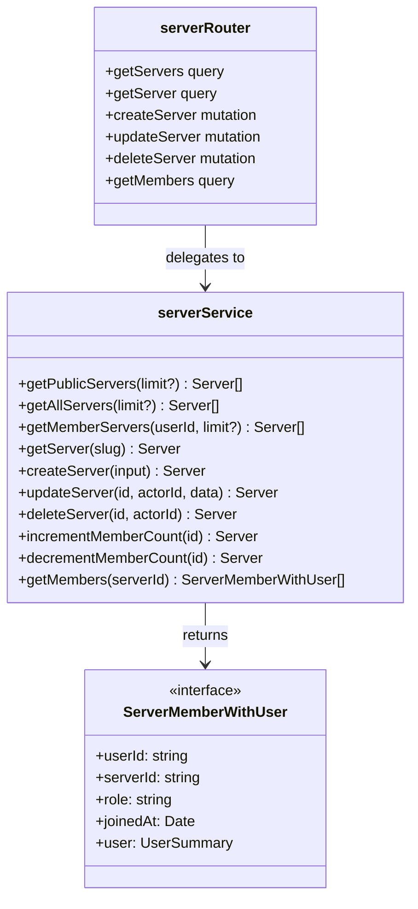
```mermaid
classDiagram
    class serverService {
        +getPublicServers(limit?) Server[]
        +getAllServers(limit?) Server[]
        +getMemberServers(userId, limit?) Server[]
        +getServer(slug) Server
        +createServer(input) Server
        +updateServer(id, actorId, data) Server
        +deleteServer(id, actorId) Server
        +incrementMemberCount(id) Server
        +decrementMemberCount(id) Server
        +getMembers(serverId) ServerMemberWithUser[]
    }

    class serverRouter {
        +getServers query
        +getServer query
        +createServer mutation
        +updateServer mutation
        +deleteServer mutation
        +getMembers query
    }

    class ServerMemberWithUser {
        <<interface>>
        +userId: string
        +serverId: string
        +role: string
        +joinedAt: Date
        +user: UserSummary
    }

    serverRouter --> serverService : delegates to
    serverService --> ServerMemberWithUser : returns
```

### 8. Code Generation

Implementation code is located in:
- `backend/src/services/server.service.ts`
- `backend/src/trpc/routers/server.router.ts`
- `backend/src/lib/admin.utils.ts` — system admin detection

---

## Module 3: Channel Management

### 1. Features

| Capability | Description |
|---|---|
| Create channel | Creates a TEXT, VOICE, or ANNOUNCEMENT channel within a server. Assigns a URL slug, optional topic, and position. Default visibility: PRIVATE. |
| List channels | Returns all channels in a server, ordered by position. |
| Get channel | Retrieves a single channel by server slug + channel slug. |
| Update channel | Modify name, topic, or position. |
| Delete channel | Hard delete with cascading removal of associated messages and audit log entries. |
| Set visibility | Changes channel visibility among `PUBLIC_INDEXABLE`, `PUBLIC_NO_INDEX`, and `PRIVATE`. Writes an audit log entry and publishes a `VISIBILITY_CHANGED` event. |
| Get visibility | Returns the current visibility of a channel. Served from Redis cache when available. |
| Default channel | Automatically creates a `#general` TEXT channel when a server is created. |

**What it does not do:** Does not handle channel permissions per-user (beyond server-level roles), channel categories/folders, or channel archiving.

### 2. Internal Architecture

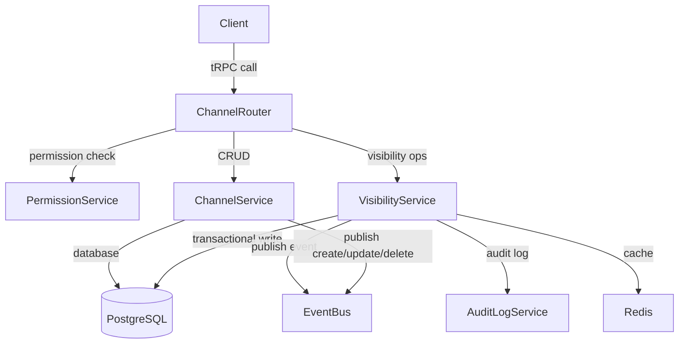
```mermaid
flowchart TD
    Client -->|tRPC call| ChannelRouter
    ChannelRouter -->|permission check| PermissionService
    ChannelRouter -->|CRUD| ChannelService
    ChannelRouter -->|visibility ops| VisibilityService
    ChannelService -->|database| Prisma[(PostgreSQL)]
    VisibilityService -->|transactional write| Prisma
    VisibilityService -->|audit log| AuditLogService
    VisibilityService -->|publish event| EventBus
    VisibilityService -->|cache| CacheService[Redis]
    ChannelService -->|publish create/update/delete| EventBus
```

**Design justification:** Visibility changes are isolated into a dedicated `VisibilityService` because they involve a transactional write (update channel + insert audit log), cache invalidation, and event publication — a more complex lifecycle than standard CRUD. The `CacheService` stores visibility values in Redis (TTL 1 hour) since every public page load checks visibility.

### 3. Data Abstraction

A **Channel** belongs to exactly one Server. It has a type (TEXT, VOICE, ANNOUNCEMENT), a visibility level controlling public access and search-engine indexing, and a position for ordering in the UI.

The **VisibilityChangeResult** value object captures the outcome of a visibility transition for the caller and for the audit trail.

### 4. Stable Storage

```prisma
model Channel {
  id         String            @id @default(uuid())
  serverId   String
  name       String
  slug       String
  type       ChannelType       @default(TEXT)
  visibility ChannelVisibility @default(PRIVATE)
  topic      String?
  position   Int               @default(0)
  indexedAt   DateTime?
  createdAt  DateTime          @default(now())
  updatedAt  DateTime          @updatedAt
  server     Server            @relation(fields: [serverId], references: [id])
  messages   Message[]
  auditLog   VisibilityAuditLog[]
  @@unique([serverId, slug])
}

model VisibilityAuditLog {
  id        String   @id @default(uuid())
  channelId String
  actorId   String
  action    String
  oldValue  Json
  newValue  Json
  timestamp DateTime @default(now())
  ipAddress String
  userAgent String
  channel   Channel  @relation(fields: [channelId], references: [id])
  actor     User     @relation(fields: [actorId], references: [id])
}
```

Cache key: `harmony:channel:visibility:{channelId}` → Redis string, TTL 3600s.

### 5. External API

| Procedure | Type | Input | Permission |
|---|---|---|---|
| `channel.getChannels` | query | `{ serverId }` | `server:read` |
| `channel.getChannel` | query | `{ serverId, serverSlug, channelSlug }` | `channel:read` |
| `channel.createChannel` | mutation | `{ serverId, name, slug, type?, visibility?, topic?, position? }` | `channel:create` |
| `channel.updateChannel` | mutation | `{ serverId, channelId, name?, topic?, position? }` | `channel:update` |
| `channel.deleteChannel` | mutation | `{ serverId, channelId }` | `channel:delete` |
| `channel.setVisibility` | mutation | `{ serverId, channelId, visibility }` | `channel:manage_visibility` |
| `channel.getVisibility` | query | `{ serverId, channelId }` | `channel:read` |

### 6. Class/Method/Field Declarations

```typescript
// ── Public ──────────────────────────────────────────────

export const channelService = {
  getChannels(serverId: string): Promise<Channel[]>;
  getChannelBySlug(serverSlug: string, channelSlug: string): Promise<Channel>;
  createChannel(input: CreateChannelInput): Promise<Channel>;
  updateChannel(channelId: string, serverId: string, patch: UpdateChannelInput): Promise<Channel>;
  deleteChannel(channelId: string, serverId: string): Promise<void>;
  createDefaultChannel(serverId: string): Promise<Channel>;
};

interface CreateChannelInput {
  serverId: string; name: string; slug: string;
  type: ChannelType; visibility: ChannelVisibility;
  topic?: string; position?: number;
}
interface UpdateChannelInput { name?: string; topic?: string; position?: number; }

export const visibilityService = {
  getVisibility(channelId: string, serverId: string): Promise<ChannelVisibility>;
  setVisibility(input: SetVisibilityInput): Promise<VisibilityChangeResult>;
};

interface SetVisibilityInput {
  channelId: string; serverId: string;
  visibility: ChannelVisibility; actorId: string;
  ip: string; userAgent?: string;
}
interface VisibilityChangeResult {
  success: boolean; channelId: string;
  oldVisibility: ChannelVisibility; newVisibility: ChannelVisibility;
  auditLogId: string;
}

export const auditLogService = {
  logVisibilityChange(input: LogVisibilityChangeInput, tx?: TransactionClient): Promise<VisibilityAuditLog>;
  getVisibilityAuditLog(channelId: string, options?: GetAuditLogOptions): Promise<AuditLogPage>;
};

export const channelRouter: tRPC.Router;
```

### 7. Class Hierarchy Diagram

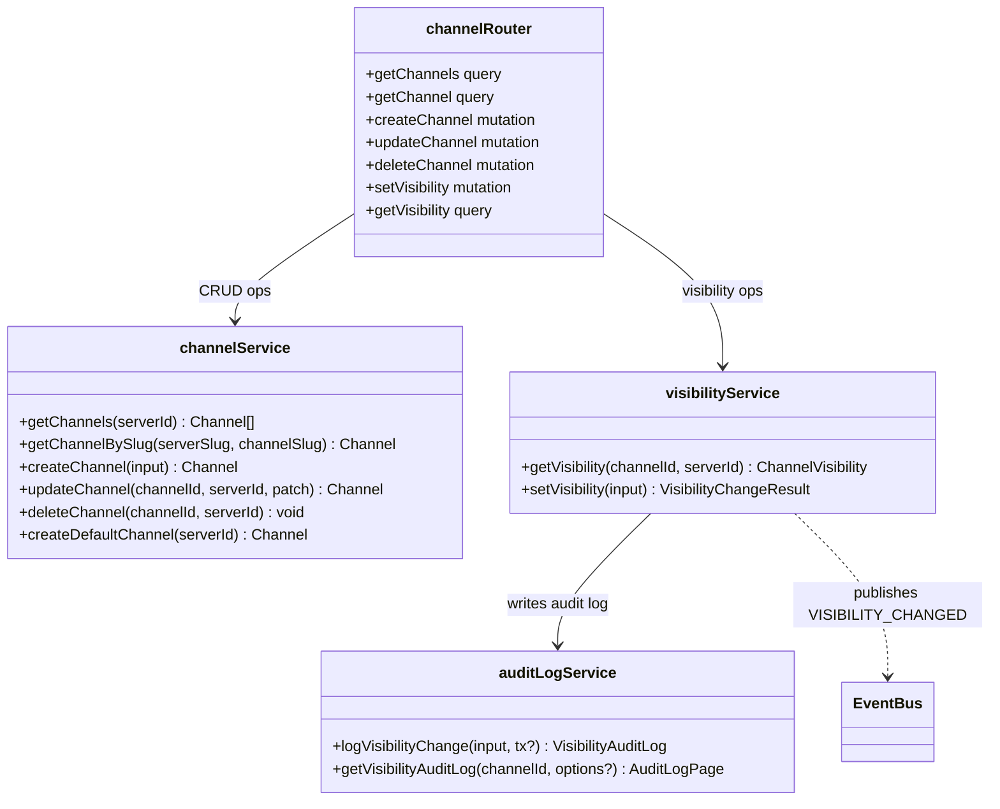
```mermaid
classDiagram
    class channelService {
        +getChannels(serverId) Channel[]
        +getChannelBySlug(serverSlug, channelSlug) Channel
        +createChannel(input) Channel
        +updateChannel(channelId, serverId, patch) Channel
        +deleteChannel(channelId, serverId) void
        +createDefaultChannel(serverId) Channel
    }

    class visibilityService {
        +getVisibility(channelId, serverId) ChannelVisibility
        +setVisibility(input) VisibilityChangeResult
    }

    class auditLogService {
        +logVisibilityChange(input, tx?) VisibilityAuditLog
        +getVisibilityAuditLog(channelId, options?) AuditLogPage
    }

    class channelRouter {
        +getChannels query
        +getChannel query
        +createChannel mutation
        +updateChannel mutation
        +deleteChannel mutation
        +setVisibility mutation
        +getVisibility query
    }

    channelRouter --> channelService : CRUD ops
    channelRouter --> visibilityService : visibility ops
    visibilityService --> auditLogService : writes audit log
    visibilityService ..> EventBus : publishes VISIBILITY_CHANGED
```

### 8. Code Generation

Implementation code is located in:
- `backend/src/services/channel.service.ts`
- `backend/src/services/visibility.service.ts`
- `backend/src/services/auditLog.service.ts`
- `backend/src/trpc/routers/channel.router.ts`

---

## Module 4: Message Management

### 1. Features

| Capability | Description |
|---|---|
| Send message | Creates a message in a channel with optional attachments (max 10, 4000 char content limit). Publishes `MESSAGE_CREATED` event. |
| Get messages | Cursor-based pagination (oldest first — ascending chronological order, max 100 per page). Returns messages with author and attachment data. |
| Edit message | Author can edit their own message content. Updates `editedAt` timestamp. Publishes `MESSAGE_EDITED` event. |
| Delete message | Soft-delete. Members can delete own messages; moderators+ can delete any. Publishes `MESSAGE_DELETED` event. |
| Pin / Unpin | Moderators+ can pin or unpin messages. Tracks `pinnedAt` timestamp. |
| List pinned | Returns all pinned messages in a channel. |
| Reply (threading) | Creates a reply linked to a parent message. Increments parent's `replyCount`. |
| Get thread | Cursor-based pagination of replies to a specific message. |

**What it does not do:** Does not support message search, rich embeds, or message scheduling. Emoji reactions are handled by the **Reaction** module.

### 2. Internal Architecture

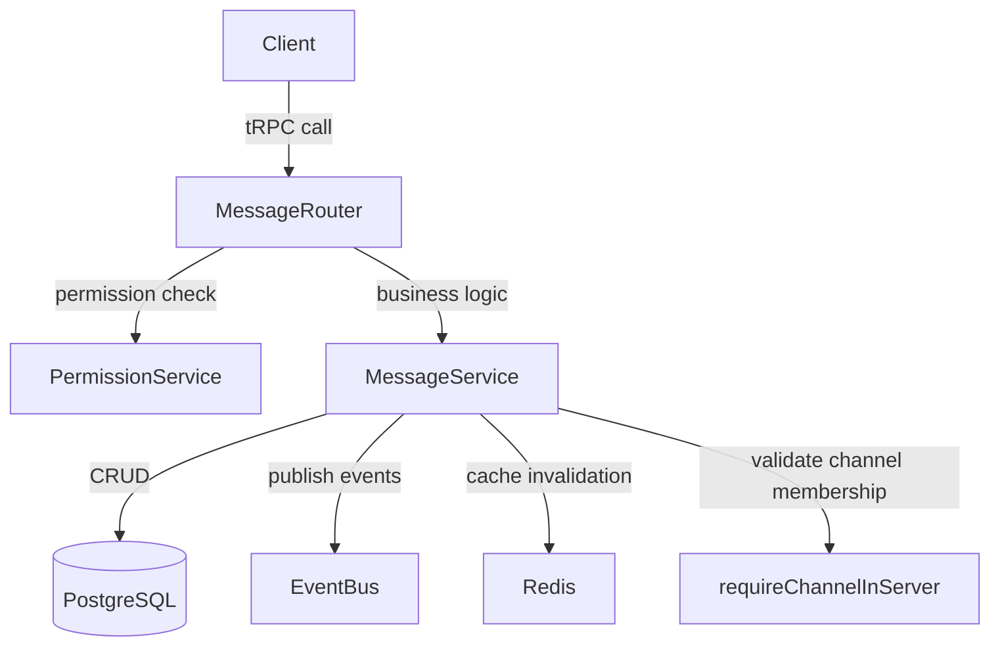
```mermaid
flowchart TD
    Client -->|tRPC call| MessageRouter
    MessageRouter -->|permission check| PermissionService
    MessageRouter -->|business logic| MessageService
    MessageService -->|CRUD| Prisma[(PostgreSQL)]
    MessageService -->|publish events| EventBus
    MessageService -->|cache invalidation| CacheService[Redis]
    MessageService -->|validate channel membership| ChannelCheck[requireChannelInServer]
```

**Design justification:** Cursor-based pagination (using message ID as cursor) was chosen over offset-based pagination because it remains performant as message volume grows and avoids skipped/duplicate results from concurrent inserts. Soft-delete preserves message metadata for audit and threading integrity. The `replyCount` is denormalized to avoid COUNT queries and is guarded against going negative (floored at 0).

### 3. Data Abstraction

A **Message** belongs to a Channel and has an author (User). It may optionally be a reply to a parent Message, forming a thread. Messages are never physically deleted — the `isDeleted` flag marks them as removed while preserving the record for threading and audit purposes.

### 4. Stable Storage

```prisma
model Message {
  id              String    @id @default(uuid())
  channelId       String
  authorId        String
  content         String
  createdAt       DateTime  @default(now())
  editedAt        DateTime?
  isDeleted       Boolean   @default(false)
  pinned          Boolean   @default(false)
  pinnedAt        DateTime?
  parentMessageId String?
  replyCount      Int       @default(0)
  channel         Channel          @relation(fields: [channelId], references: [id])
  author          User             @relation(fields: [authorId], references: [id])
  attachments     Attachment[]
  reactions       MessageReaction[]
  parent          Message?         @relation("MessageReplies", fields: [parentMessageId], references: [id])
  replies         Message[]        @relation("MessageReplies")
}

model MessageReaction {
  id        String   @id @default(uuid())
  messageId String
  userId    String
  emoji     String
  createdAt DateTime @default(now())
  message   Message  @relation(fields: [messageId], references: [id], onDelete: Cascade)
  user      User     @relation(fields: [userId], references: [id], onDelete: Cascade)
  @@unique([messageId, userId, emoji])
}

model Attachment {
  id          String  @id @default(uuid())
  messageId   String
  filename    String
  url         String
  contentType String
  sizeBytes   BigInt
  message     Message @relation(fields: [messageId], references: [id])
}
```

### 5. External API

| Procedure | Type | Input | Permission |
|---|---|---|---|
| `message.getMessages` | query | `{ serverId, channelId, cursor?, limit? }` | `message:read` |
| `message.sendMessage` | mutation | `{ serverId, channelId, content, attachments? }` | `message:create` |
| `message.editMessage` | mutation | `{ serverId, messageId, content }` | `message:update_own` |
| `message.deleteMessage` | mutation | `{ serverId, messageId }` | `message:delete_own` |
| `message.pinMessage` | mutation | `{ serverId, messageId }` | `message:pin` |
| `message.unpinMessage` | mutation | `{ serverId, messageId }` | `message:pin` |
| `message.getPinnedMessages` | query | `{ serverId, channelId }` | `message:read` |
| `message.createReply` | mutation | `{ serverId, channelId, parentMessageId, content }` | `message:create` |
| `message.getThreadMessages` | query | `{ serverId, channelId, parentMessageId, cursor?, limit? }` | `message:read` |

### 6. Class/Method/Field Declarations

```typescript
// ── Public ──────────────────────────────────────────────

export const messageService = {
  getMessages(input: GetMessagesInput): Promise<{ messages: Message[]; nextCursor: string | null; hasMore: boolean }>;
  sendMessage(input: SendMessageInput): Promise<Message>;
  editMessage(input: EditMessageInput): Promise<Message>;
  deleteMessage(input: DeleteMessageInput): Promise<void>;
  pinMessage(messageId: string, serverId: string): Promise<Message>;
  unpinMessage(messageId: string, serverId: string): Promise<Message>;
  getPinnedMessages(channelId: string, serverId: string): Promise<Message[]>;
  createReply(input: CreateReplyInput): Promise<Message>;
  getThreadMessages(input: GetThreadMessagesInput): Promise<{ replies: Message[]; nextCursor: string | null; hasMore: boolean }>;
};

interface GetMessagesInput { serverId: string; channelId: string; cursor?: string; limit?: number; }
interface SendMessageInput { serverId: string; channelId: string; authorId: string; content: string; attachments?: AttachmentInput[]; }
interface EditMessageInput { serverId: string; messageId: string; authorId: string; content: string; }
interface DeleteMessageInput { messageId: string; actorId: string; serverId: string; }
interface CreateReplyInput { parentMessageId: string; channelId: string; serverId: string; authorId: string; content: string; }
interface GetThreadMessagesInput { parentMessageId: string; channelId: string; serverId: string; cursor?: string; limit?: number; }

export const messageRouter: tRPC.Router;

// ── Private ─────────────────────────────────────────────

const AUTHOR_SELECT: Prisma.UserSelect;
const ATTACHMENT_SELECT: Prisma.AttachmentSelect;
const MESSAGE_INCLUDE: Prisma.MessageInclude;
function msgCacheKey(serverId, channelId, cursor?, limit?): string;
function requireChannelInServer(channelId, serverId): Promise<Channel>;
function requireMessageInServer(messageId, serverId): Promise<Message>;
```

### 7. Class Hierarchy Diagram

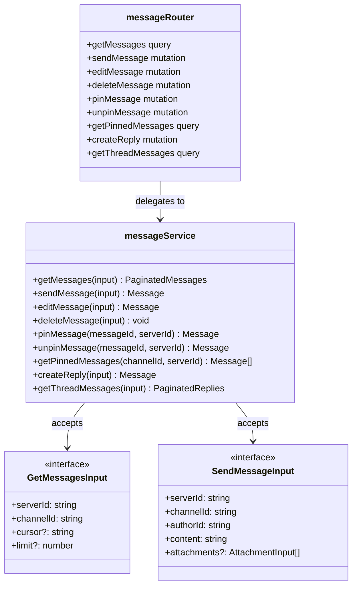
```mermaid
classDiagram
    class messageService {
        +getMessages(input) PaginatedMessages
        +sendMessage(input) Message
        +editMessage(input) Message
        +deleteMessage(input) void
        +pinMessage(messageId, serverId) Message
        +unpinMessage(messageId, serverId) Message
        +getPinnedMessages(channelId, serverId) Message[]
        +createReply(input) Message
        +getThreadMessages(input) PaginatedReplies
    }

    class messageRouter {
        +getMessages query
        +sendMessage mutation
        +editMessage mutation
        +deleteMessage mutation
        +pinMessage mutation
        +unpinMessage mutation
        +getPinnedMessages query
        +createReply mutation
        +getThreadMessages query
    }

    class GetMessagesInput {
        <<interface>>
        +serverId: string
        +channelId: string
        +cursor?: string
        +limit?: number
    }

    class SendMessageInput {
        <<interface>>
        +serverId: string
        +channelId: string
        +authorId: string
        +content: string
        +attachments?: AttachmentInput[]
    }

    messageRouter --> messageService : delegates to
    messageService --> GetMessagesInput : accepts
    messageService --> SendMessageInput : accepts
```

### 8. Code Generation

Implementation code is located in:
- `backend/src/services/message.service.ts`
- `backend/src/trpc/routers/message.router.ts`

---

## Module 5: User Management

### 1. Features

| Capability | Description |
|---|---|
| Get current user | Returns the authenticated user's full profile, including email and system admin status. |
| Get user | Returns another user's public profile (id, username, displayName, avatar, status, createdAt). |
| Update user | Modify display name, avatar URL (HTTPS validated), online status (ONLINE/IDLE/DND/OFFLINE), and profile visibility (public/private). |

**What it does not do:** Does not handle user deletion, account deactivation, user search, friend lists, or direct messages.

### 2. Internal Architecture

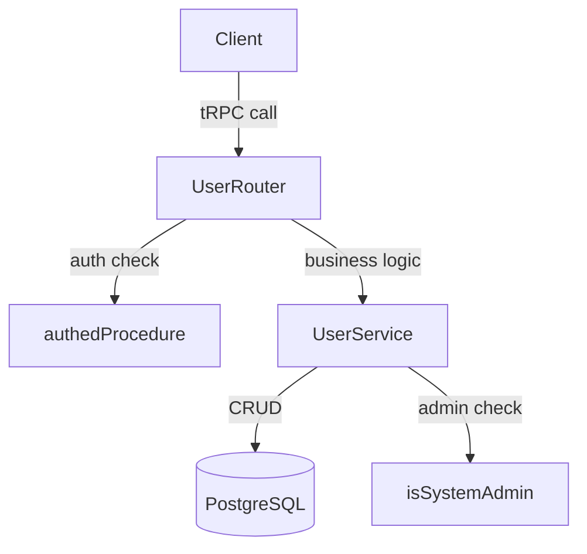
```mermaid
flowchart TD
    Client -->|tRPC call| UserRouter
    UserRouter -->|auth check| authedProcedure
    UserRouter -->|business logic| UserService
    UserService -->|CRUD| Prisma[(PostgreSQL)]
    UserService -->|admin check| AdminUtils[isSystemAdmin]
```

**Design justification:** The user module is intentionally thin — it serves profile data and delegates authentication concerns to the Auth module. The `isSystemAdmin` check queries the database for the admin email rather than storing a role flag, keeping the user model simple and avoiding privilege-escalation risks from a mutable field.

### 3. Data Abstraction

A **User** has a unique email and username. The `displayName` is a user-facing name that can differ from the username. The `status` enum represents the user's current availability. The `publicProfile` boolean controls whether other users can view their profile.

### 4. Stable Storage

```prisma
model User {
  id            String     @id @default(uuid())
  email         String     @unique
  username      String     @unique
  passwordHash  String
  displayName   String
  avatarUrl     String?
  publicProfile Boolean    @default(true)
  status        UserStatus @default(OFFLINE)
  createdAt     DateTime   @default(now())
}

enum UserStatus { ONLINE, IDLE, DND, OFFLINE }
```

### 5. External API

| Procedure | Type | Input | Permission |
|---|---|---|---|
| `user.getCurrentUser` | query | (none — uses auth context) | Authenticated |
| `user.getUser` | query | `{ userId }` | Authenticated |
| `user.updateUser` | mutation | `{ displayName?, avatarUrl?, publicProfile?, status? }` | Authenticated (self only) |

### 6. Class/Method/Field Declarations

```typescript
// ── Public ──────────────────────────────────────────────

export const userService = {
  getUser(userId: string): Promise<User>;
  getCurrentUser(userId: string): Promise<User & { isSystemAdmin: boolean }>;
  updateUser(userId: string, patch: UpdateUserInput): Promise<User>;
};

interface UpdateUserInput {
  displayName?: string;
  avatarUrl?: string | null;
  publicProfile?: boolean;
  status?: UserStatus;
}

export const userRouter: tRPC.Router;

// ── Private ─────────────────────────────────────────────

const PUBLIC_PROFILE_SELECT: Prisma.UserSelect;
const SELF_PROFILE_SELECT: Prisma.UserSelect;
```

### 7. Class Hierarchy Diagram

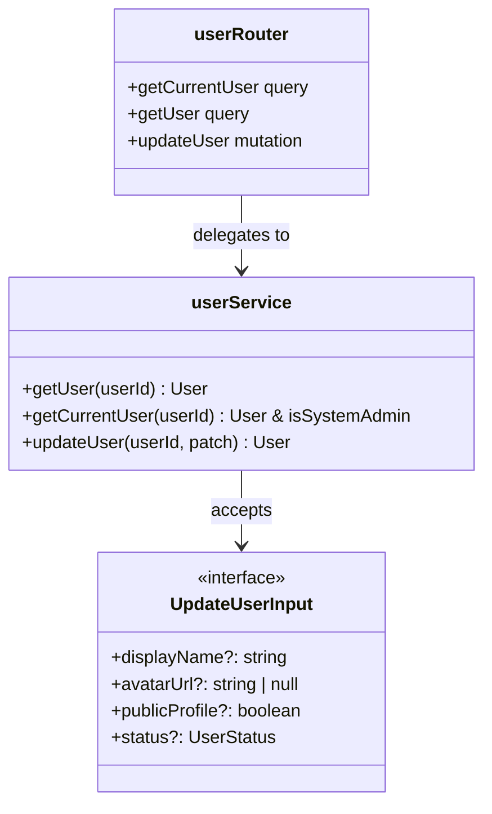
```mermaid
classDiagram
    class userService {
        +getUser(userId) User
        +getCurrentUser(userId) User & isSystemAdmin
        +updateUser(userId, patch) User
    }

    class userRouter {
        +getCurrentUser query
        +getUser query
        +updateUser mutation
    }

    class UpdateUserInput {
        <<interface>>
        +displayName?: string
        +avatarUrl?: string | null
        +publicProfile?: boolean
        +status?: UserStatus
    }

    userRouter --> userService : delegates to
    userService --> UpdateUserInput : accepts
```

### 8. Code Generation

Implementation code is located in:
- `backend/src/services/user.service.ts`
- `backend/src/trpc/routers/user.router.ts`

---

## Module 6: Server Membership & Roles

### 1. Features

| Capability | Description |
|---|---|
| Join server | User joins a public server as MEMBER role. Increments server `memberCount`. Publishes `MEMBER_JOINED` event. |
| Leave server | User leaves a server. Owners cannot leave (must transfer or delete). Decrements `memberCount`. Publishes `MEMBER_LEFT` event. |
| List members | Returns all members with user profile summaries. |
| Change role | Admins+ can change a member's role. Enforces hierarchy: cannot promote above own rank or demote someone of equal/higher rank. |
| Remove member | Admins+ can kick a member. Cannot kick someone of equal/higher rank. |

**What it does not do:** Does not handle server invitations, ban lists, role transfer, or custom roles.

### 2. Internal Architecture

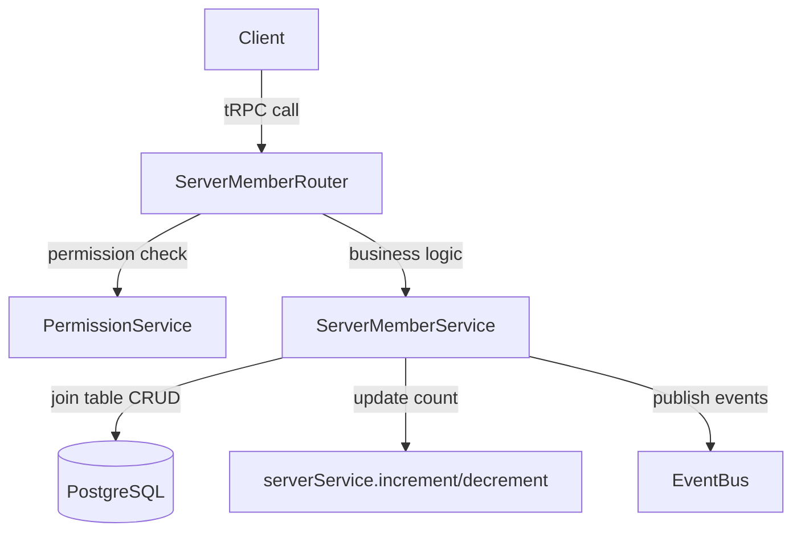
```mermaid
flowchart TD
    Client -->|tRPC call| ServerMemberRouter
    ServerMemberRouter -->|permission check| PermissionService
    ServerMemberRouter -->|business logic| ServerMemberService
    ServerMemberService -->|join table CRUD| Prisma[(PostgreSQL)]
    ServerMemberService -->|update count| ServerService[serverService.increment/decrement]
    ServerMemberService -->|publish events| EventBus
```

**Design justification:** The role hierarchy is defined as an ordered array `['OWNER', 'ADMIN', 'MODERATOR', 'MEMBER', 'GUEST']` with a numeric rank function. All role-change and kick operations compare ranks to enforce that a user can only manage users below them. This prevents privilege escalation without complex ACL infrastructure.

### 3. Data Abstraction

A **ServerMember** is a join entity between User and Server, carrying a `role` from the `RoleType` enum. The role determines permissions via the Permission module. The composite primary key `[userId, serverId]` ensures a user can only be a member of a server once.

**Role hierarchy:** OWNER > ADMIN > MODERATOR > MEMBER > GUEST

### 4. Stable Storage

```prisma
model ServerMember {
  userId   String
  serverId String
  role     RoleType @default(MEMBER)
  joinedAt DateTime @default(now())
  user     User     @relation(fields: [userId], references: [id])
  server   Server   @relation(fields: [serverId], references: [id])
  @@id([userId, serverId])
}

enum RoleType { OWNER, ADMIN, MODERATOR, MEMBER, GUEST }
```

### 5. External API

| Procedure | Type | Input | Permission |
|---|---|---|---|
| `serverMember.joinServer` | mutation | `{ serverId }` | Authenticated |
| `serverMember.leaveServer` | mutation | `{ serverId }` | Authenticated |
| `serverMember.getMembers` | query | `{ serverId }` | `server:read` |
| `serverMember.changeRole` | mutation | `{ serverId, targetUserId, newRole }` | `server:manage_members` |
| `serverMember.removeMember` | mutation | `{ serverId, targetUserId }` | `server:manage_members` |

### 6. Class/Method/Field Declarations

```typescript
// ── Public ──────────────────────────────────────────────

export const serverMemberService = {
  addOwner(userId: string, serverId: string): Promise<ServerMember>;
  joinServer(userId: string, serverId: string): Promise<ServerMember>;
  leaveServer(userId: string, serverId: string): Promise<void>;
  getServerMembers(serverId: string): Promise<ServerMemberWithUser[]>;
  changeRole(targetUserId: string, serverId: string, newRole: RoleType, actorId: string): Promise<ServerMember>;
  removeMember(targetUserId: string, serverId: string, actorId: string): Promise<void>;
};

interface ServerMemberWithUser {
  userId: string; serverId: string; role: RoleType; joinedAt: Date;
  user: { id: string; username: string; displayName: string; avatarUrl: string | null; };
}

export const serverMemberRouter: tRPC.Router;

// ── Private ─────────────────────────────────────────────

const ROLE_HIERARCHY: RoleType[];
function roleRank(role: RoleType): number;
```

### 7. Class Hierarchy Diagram

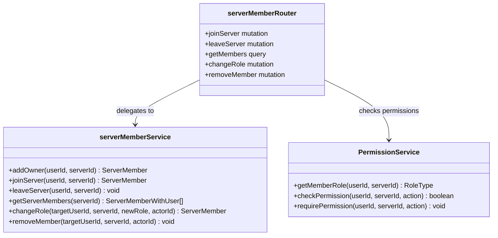
```mermaid
classDiagram
    class serverMemberService {
        +addOwner(userId, serverId) ServerMember
        +joinServer(userId, serverId) ServerMember
        +leaveServer(userId, serverId) void
        +getServerMembers(serverId) ServerMemberWithUser[]
        +changeRole(targetUserId, serverId, newRole, actorId) ServerMember
        +removeMember(targetUserId, serverId, actorId) void
    }

    class serverMemberRouter {
        +joinServer mutation
        +leaveServer mutation
        +getMembers query
        +changeRole mutation
        +removeMember mutation
    }

    class PermissionService {
        +getMemberRole(userId, serverId) RoleType
        +checkPermission(userId, serverId, action) boolean
        +requirePermission(userId, serverId, action) void
    }

    serverMemberRouter --> serverMemberService : delegates to
    serverMemberRouter --> PermissionService : checks permissions
```

### 8. Code Generation

Implementation code is located in:
- `backend/src/services/serverMember.service.ts`
- `backend/src/services/permission.service.ts`
- `backend/src/trpc/routers/serverMember.router.ts`

---

## Module 7: Voice Communication

### 1. Features

| Capability | Description |
|---|---|
| Join voice channel | Validates channel is VOICE type, generates a Twilio access token, adds user to participant list in Redis. Publishes `USER_JOINED_VOICE` event. |
| Leave voice channel | Removes user from Redis participant list. Idempotent. Publishes `USER_LEFT_VOICE` event. Destroys Twilio room if last participant. |
| Update state | Toggles muted/deafened status for a participant. Publishes `VOICE_STATE_CHANGED` event. |
| Get participants | Returns current participants with their mute/deafen state from Redis. |
| Mock mode | Supports a mock mode (env `TWILIO_MOCK=true`) for development without Twilio credentials. |

**What it does not do:** Does not handle screen sharing, video, recording, or direct (non-channel) voice calls.

### 2. Internal Architecture

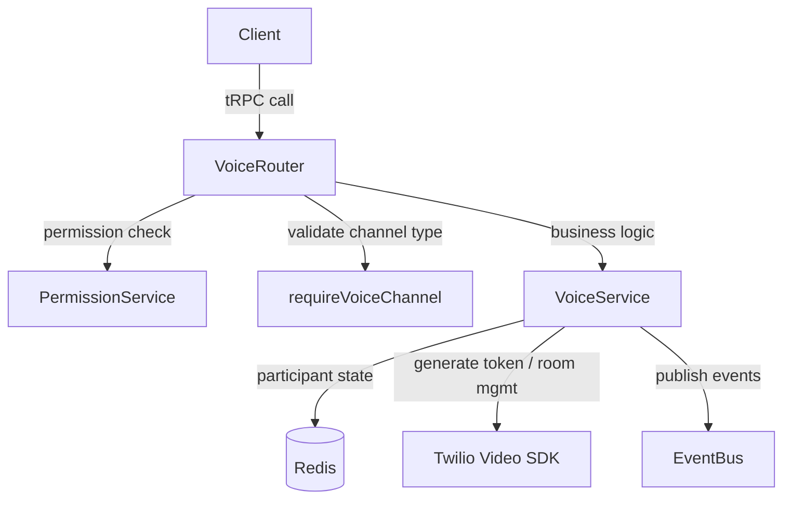
```mermaid
flowchart TD
    Client -->|tRPC call| VoiceRouter
    VoiceRouter -->|permission check| PermissionService
    VoiceRouter -->|validate channel type| requireVoiceChannel
    VoiceRouter -->|business logic| VoiceService
    VoiceService -->|participant state| Redis[(Redis)]
    VoiceService -->|generate token / room mgmt| Twilio[Twilio Video SDK]
    VoiceService -->|publish events| EventBus
```

**Design justification:** Participant state is stored in Redis rather than PostgreSQL because it is ephemeral — it only matters while users are connected. Redis hashes provide O(1) lookups and natural TTL-based cleanup (24h TTL) if a client disconnects without a clean leave. Twilio handles the actual WebRTC media relay, keeping the backend stateless for audio transport.

### 3. Data Abstraction

A **ParticipantState** represents a user currently in a voice channel, with their `muted` and `deafened` boolean flags.

Redis storage:
- Key: `voice:channel:{channelId}:participants` — a Redis Set of userIds currently in the channel.
- Key: `voice:user:{userId}:voice` — a Redis Hash with fields: `channelId`, `muted` (0/1), `deafened` (0/1). Tracks which channel a user is currently in (for single-channel enforcement).

### 4. Stable Storage

This module uses **Redis** (not PostgreSQL) for participant tracking because voice state is ephemeral. All keys have a 24-hour TTL (`VOICE_TTL_SECONDS = 86400`).

No persistent database schema is required. Channel metadata (type = VOICE) is stored in the Channel table (see Module 3).

### 5. External API

| Procedure | Type | Input | Permission |
|---|---|---|---|
| `voice.join` | mutation | `{ serverId, channelId }` | `channel:read` |
| `voice.leave` | mutation | `{ serverId, channelId }` | `channel:read` |
| `voice.updateState` | mutation | `{ serverId, channelId, muted, deafened }` | `channel:read` |
| `voice.getParticipants` | query | `{ serverId, channelId }` | `channel:read` |

### 6. Class/Method/Field Declarations

```typescript
// ── Public ──────────────────────────────────────────────

export interface ParticipantState {
  userId: string;
  muted: boolean;
  deafened: boolean;
}

export interface UpdateStateInput {
  muted: boolean;
  deafened: boolean;
}

export const voiceService = {
  generateToken(userId: string, channelId: string): string;
  join(userId: string, channelId: string): Promise<{ token: string; participants: ParticipantState[] }>;
  leave(userId: string, channelId: string): Promise<void>;
  updateState(userId: string, channelId: string, state: UpdateStateInput): Promise<void>;
  getParticipants(channelId: string): Promise<ParticipantState[]>;
};

export function participantsKey(channelId: string): string;

export const voiceRouter: tRPC.Router;

// ── Private ─────────────────────────────────────────────

const VOICE_TTL_SECONDS: 86400;
function sanitizeSegment(segment: string): string;
function userVoiceKey(userId: string): string;
function isMockMode(): boolean;
function destroyTwilioRoom(channelId: string): Promise<void>;
function requireVoiceChannel(channelId: string, serverId: string): Promise<Channel>;
```

### 7. Class Hierarchy Diagram

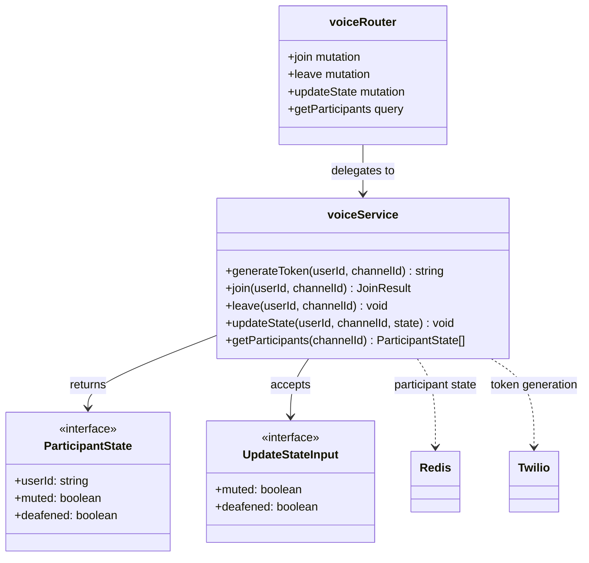
```mermaid
classDiagram
    class voiceService {
        +generateToken(userId, channelId) string
        +join(userId, channelId) JoinResult
        +leave(userId, channelId) void
        +updateState(userId, channelId, state) void
        +getParticipants(channelId) ParticipantState[]
    }

    class voiceRouter {
        +join mutation
        +leave mutation
        +updateState mutation
        +getParticipants query
    }

    class ParticipantState {
        <<interface>>
        +userId: string
        +muted: boolean
        +deafened: boolean
    }

    class UpdateStateInput {
        <<interface>>
        +muted: boolean
        +deafened: boolean
    }

    voiceRouter --> voiceService : delegates to
    voiceService --> ParticipantState : returns
    voiceService --> UpdateStateInput : accepts
    voiceService ..> Redis : participant state
    voiceService ..> Twilio : token generation
```

### 8. Code Generation

Implementation code is located in:
- `backend/src/services/voice.service.ts`
- `backend/src/trpc/routers/voice.router.ts`

---

## Module 8: Attachment / File Upload

### 1. Features

| Capability | Description |
|---|---|
| Upload file | Accepts multipart file upload (max 25 MB). Validates MIME type against allowlist using magic-byte detection. Sanitizes filename. Stores to local disk (dev) or S3 (production). |
| Serve file | Serves uploaded files from local storage (development only; production uses S3 URLs). |
| List by message | Returns all attachment metadata for a given message. |
| MIME validation | Validates both the declared Content-Type and actual file bytes (magic-byte detection) to prevent spoofed uploads. |

**What it does not do:** Does not handle image resizing/thumbnailing, virus scanning, or CDN distribution.

### 2. Internal Architecture

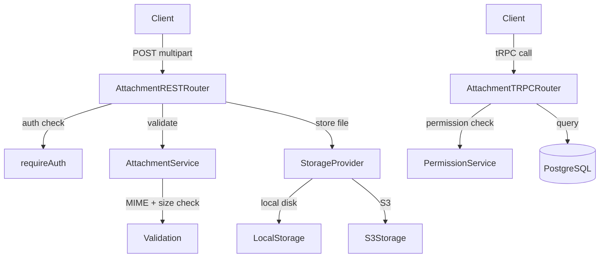
```mermaid
flowchart TD
    Client -->|POST multipart| AttachmentRESTRouter
    AttachmentRESTRouter -->|auth check| requireAuth
    AttachmentRESTRouter -->|validate| AttachmentService
    AttachmentService -->|MIME + size check| Validation
    AttachmentRESTRouter -->|store file| StorageProvider
    StorageProvider -->|local disk| LocalStorage
    StorageProvider -->|S3| S3Storage

    Client2[Client] -->|tRPC call| AttachmentTRPCRouter
    AttachmentTRPCRouter -->|permission check| PermissionService
    AttachmentTRPCRouter -->|query| Prisma[(PostgreSQL)]
```

**Design justification:** File upload uses a REST endpoint (not tRPC) because multipart form data does not fit naturally into tRPC's JSON-RPC paradigm. The storage provider abstraction allows switching between local disk (for development) and S3 (for production) without changing the upload logic. Magic-byte validation prevents clients from uploading executable files disguised with image MIME types.

### 3. Data Abstraction

An **Attachment** is a file associated with a Message. It stores metadata (filename, URL, content type, size) in PostgreSQL while the actual file bytes live in external storage (local disk or S3). The `sizeBytes` field uses BigInt to accommodate files up to 25 MB without integer overflow concerns in JavaScript.

### 4. Stable Storage

```prisma
model Attachment {
  id          String  @id @default(uuid())
  messageId   String
  filename    String
  url         String
  contentType String
  sizeBytes   BigInt
  message     Message @relation(fields: [messageId], references: [id])
}
```

File storage: local filesystem (`uploads/` directory in dev) or S3 bucket (production).

### 5. External API

**REST endpoints:**

| Method | Endpoint | Auth | Description |
|---|---|---|---|
| POST | `/api/attachments/upload` | Required | Upload file (multipart, max 25 MB) |
| GET | `/api/attachments/files/:filename` | None | Serve local files (dev only) |

**tRPC endpoint:**

| Procedure | Type | Input | Permission |
|---|---|---|---|
| `attachment.listByMessage` | query | `{ serverId, messageId }` | `message:read` |

### 6. Class/Method/Field Declarations

```typescript
// ── Public ──────────────────────────────────────────────

export const MAX_FILE_SIZE_BYTES: number; // 25 * 1024 * 1024
export const ALLOWED_CONTENT_TYPES: Set<string>;

export class AttachmentValidationError extends Error {
  constructor(message: string);
}

export class AttachmentNotFoundError extends Error {
  constructor(message?: string);
}

export const attachmentService = {
  validateUpload(contentType: string, sizeBytes: number): void;
  listByMessage(messageId: string, serverId: string): Promise<Attachment[]>;
};

export const attachmentRouter: Router;       // Express REST router
export const attachmentTRPCRouter: tRPC.Router;  // tRPC metadata router
```

### 7. Class Hierarchy Diagram

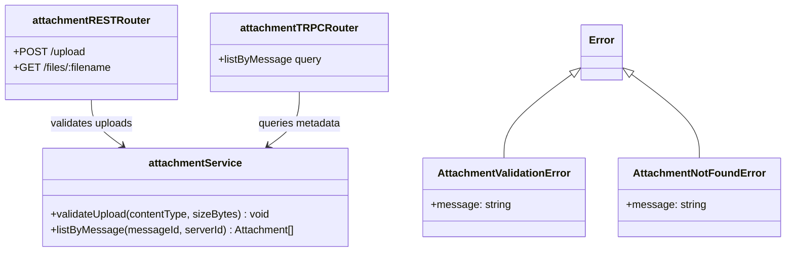
```mermaid
classDiagram
    class attachmentService {
        +validateUpload(contentType, sizeBytes) void
        +listByMessage(messageId, serverId) Attachment[]
    }

    class AttachmentValidationError {
        +message: string
    }

    class AttachmentNotFoundError {
        +message: string
    }

    class attachmentRESTRouter {
        +POST /upload
        +GET /files/:filename
    }

    class attachmentTRPCRouter {
        +listByMessage query
    }

    Error <|-- AttachmentValidationError
    Error <|-- AttachmentNotFoundError
    attachmentRESTRouter --> attachmentService : validates uploads
    attachmentTRPCRouter --> attachmentService : queries metadata
```

### 8. Code Generation

Implementation code is located in:
- `backend/src/services/attachment.service.ts`
- `backend/src/routes/attachment.router.ts` — REST upload/serve
- `backend/src/trpc/routers/attachment.router.ts` — tRPC metadata queries
- `backend/src/lib/storage/` — storage provider abstraction

---

## Module 9: Public API & SEO

### 1. Features

| Capability | Description |
|---|---|
| Public server listing | Returns top 20 public servers ordered by member count. No auth required. |
| Public server detail | Returns a public server's metadata by slug. |
| Public channel listing | Returns public channels for a server. |
| Public channel detail | Returns a public channel's metadata. |
| Public messages | Paginated messages from `PUBLIC_INDEXABLE` channels only (50/page). |
| Single message | Returns a single message from a `PUBLIC_INDEXABLE` channel. |
| robots.txt | Allows crawling of `/c/` routes; disallows `/api/`, `/trpc/`. |
| Dynamic sitemap | Generates per-server XML sitemaps of `PUBLIC_INDEXABLE` channels. |
| Caching | Stale-while-revalidate pattern. Adds `Cache-Control` and `X-Cache` headers. |
| Rate limiting | 100 req/min for humans; 1000 req/min for verified bots. |

**What it does not do:** Does not handle OpenGraph meta-tag generation (that is done by the frontend SSR layer), full-text search, or API key management for third-party consumers.

### 2. Internal Architecture

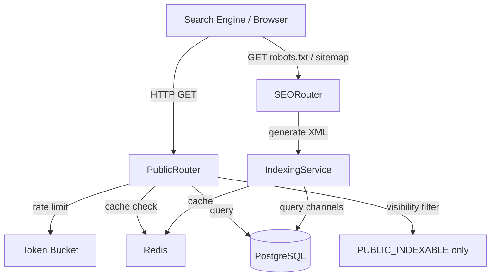
```mermaid
flowchart TD
    Crawler[Search Engine / Browser] -->|HTTP GET| PublicRouter
    Crawler -->|GET robots.txt / sitemap| SEORouter
    PublicRouter -->|rate limit| RateLimiter[Token Bucket]
    PublicRouter -->|cache check| CacheService[Redis]
    PublicRouter -->|query| Prisma[(PostgreSQL)]
    PublicRouter -->|visibility filter| VisibilityCheck[PUBLIC_INDEXABLE only]
    SEORouter -->|generate XML| IndexingService
    IndexingService -->|cache| CacheService
    IndexingService -->|query channels| Prisma
```

**Design justification:** The public API is completely separate from the tRPC layer because crawlers and external consumers require plain HTTP with standard caching headers. The stale-while-revalidate pattern ensures fast responses for frequently-accessed public pages while keeping data fresh in the background. Per-server sitemaps keep XML file sizes manageable and allow incremental re-crawling.

### 3. Data Abstraction

The public API exposes read-only views of Servers, Channels, and Messages. It applies a strict visibility filter: only channels with `visibility = PUBLIC_INDEXABLE` expose their messages. The `CacheEntry<T>` wrapper stores a `createdAt` timestamp alongside cached data for TTL and staleness checks.

### 4. Stable Storage

This module reads from the same PostgreSQL tables as the authenticated modules (Server, Channel, Message). It uses Redis for caching:

- `channel:{channelId}:visibility` — channel visibility (TTL 3600s)
- `channel:msgs:{channelId}:page:{page}` — paginated messages (TTL 60s)
- `server:{serverId}:info` — server metadata (TTL 300s)
- Sitemap cache: `sitemap:{serverSlug}` (TTL 300s)

### 5. External API

| Method | Endpoint | Description |
|---|---|---|
| GET | `/api/public/servers` | List public servers (top 20) |
| GET | `/api/public/servers/:serverSlug` | Public server info |
| GET | `/api/public/servers/:serverSlug/channels` | Public channels |
| GET | `/api/public/servers/:serverSlug/channels/:channelSlug` | Public channel info |
| GET | `/api/public/channels/:channelId/messages` | Paginated messages (PUBLIC_INDEXABLE only) |
| GET | `/api/public/channels/:channelId/messages/:messageId` | Single message |
| GET | `/robots.txt` | Crawler directives |
| GET | `/sitemap/:serverSlug.xml` | Dynamic XML sitemap |

### 6. Class/Method/Field Declarations

```typescript
// ── Public ──────────────────────────────────────────────

export const publicRouter: Router;   // Express
export const seoRouter: Router;      // Express

export const indexingService = {
  addToSitemap(channelId: string): Promise<void>;
  removeFromSitemap(channelId: string): Promise<void>;
  generateSitemap(serverSlug: string): Promise<string | null>;
  onVisibilityChanged(payload: { channelId; oldVisibility; newVisibility }): Promise<void>;
};

export const CacheKeys_Sitemap = {
  serverSitemap(serverSlug: string): string;
};

export const cacheService = {
  get<T>(key: string): Promise<CacheEntry<T> | null>;
  set<T>(key: string, data: T, options: CacheOptions): Promise<void>;
  invalidate(key: string): Promise<void>;
  invalidatePattern(pattern: string): Promise<void>;
  isStale<T>(entry: CacheEntry<T>, ttlSeconds: number): boolean;
  getOrRevalidate<T>(key: string, fetcher: () => Promise<T>, options: CacheOptions): Promise<T>;
  revalidate<T>(key: string, fetcher: () => Promise<T>, options: CacheOptions): void;
};

export interface CacheEntry<T> { data: T; createdAt: number; }
export interface CacheOptions { ttl: number; staleTtl?: number; }

export const CacheKeys: { channelVisibility; channelMessages; serverInfo; metaChannel; analysisChannel; };
export const CacheTTL: { channelVisibility: 3600; channelMessages: 60; serverInfo: 300; };

export function sanitizeKeySegment(segment: string): string;

// ── Private ─────────────────────────────────────────────

function buildSitemapXml(serverSlug, channels): string;
function escapeXml(str: string): string;
const SITEMAP_CACHE_TTL: 300;
const BASE_URL: string;
```

### 7. Class Hierarchy Diagram

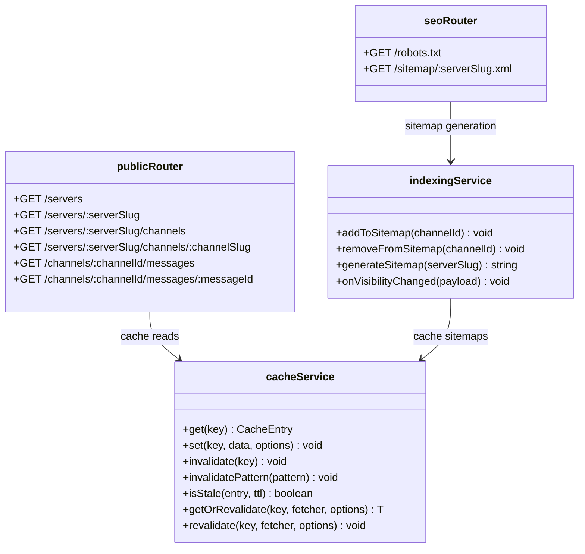
```mermaid
classDiagram
    class publicRouter {
        +GET /servers
        +GET /servers/:serverSlug
        +GET /servers/:serverSlug/channels
        +GET /servers/:serverSlug/channels/:channelSlug
        +GET /channels/:channelId/messages
        +GET /channels/:channelId/messages/:messageId
    }

    class seoRouter {
        +GET /robots.txt
        +GET /sitemap/:serverSlug.xml
    }

    class indexingService {
        +addToSitemap(channelId) void
        +removeFromSitemap(channelId) void
        +generateSitemap(serverSlug) string
        +onVisibilityChanged(payload) void
    }

    class cacheService {
        +get(key) CacheEntry
        +set(key, data, options) void
        +invalidate(key) void
        +invalidatePattern(pattern) void
        +isStale(entry, ttl) boolean
        +getOrRevalidate(key, fetcher, options) T
        +revalidate(key, fetcher, options) void
    }

    publicRouter --> cacheService : cache reads
    seoRouter --> indexingService : sitemap generation
    indexingService --> cacheService : cache sitemaps
```

### 8. Code Generation

Implementation code is located in:
- `backend/src/routes/public.router.ts`
- `backend/src/routes/seo.router.ts`
- `backend/src/services/indexing.service.ts`
- `backend/src/services/cache.service.ts`
- `backend/src/services/cacheInvalidator.service.ts`

---

## Module 10: Real-Time Events (SSE)

### 1. Features

| Capability | Description |
|---|---|
| Channel event stream | SSE endpoint delivering `message:created`, `message:edited`, `message:deleted`, and `server:updated` events for a specific channel. |
| Server event stream | SSE endpoint delivering `channel:created`, `channel:updated`, and `channel:deleted` events for a server's channel list. |
| Authentication | Uses query-parameter token (required by the `EventSource` browser API which does not support custom headers). |
| Heartbeat | Sends a keepalive comment every 30 seconds to prevent proxy/load-balancer timeouts. |
| Auto-cleanup | Unsubscribes from the EventBus and cleans up resources when the client disconnects. |

**What it does not do:** Does not support bidirectional communication (use tRPC mutations for client→server). Does not handle WebSocket upgrades or Socket.IO.

### 2. Internal Architecture

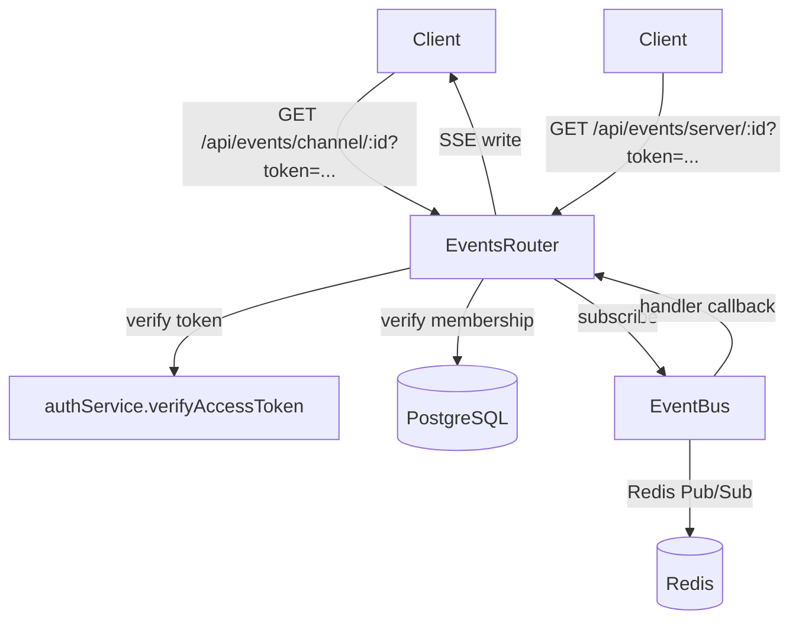
```mermaid
flowchart TD
    Client -->|GET /api/events/channel/:id?token=...| EventsRouter
    Client2[Client] -->|GET /api/events/server/:id?token=...| EventsRouter
    EventsRouter -->|verify token| AuthService[authService.verifyAccessToken]
    EventsRouter -->|verify membership| Prisma[(PostgreSQL)]
    EventsRouter -->|subscribe| EventBus
    EventBus -->|Redis Pub/Sub| Redis[(Redis)]
    EventBus -->|handler callback| EventsRouter
    EventsRouter -->|SSE write| Client
```

**Design justification:** SSE was chosen over WebSockets because it uses standard HTTP, works through proxies and CDNs without upgrade negotiation, and is natively supported by the browser `EventSource` API. The unidirectional server→client model fits the chat use case (clients send messages via tRPC mutations; they receive updates via SSE). Redis Pub/Sub enables horizontal scaling — multiple server instances can publish and subscribe to the same event channels.

### 3. Data Abstraction

The **EventBus** is an in-process pub/sub abstraction backed by Redis Pub/Sub. It defines a typed channel→payload mapping (`EventPayloadMap`) so that publishers and subscribers are type-safe.

Event channels follow the naming convention `harmony:{EVENT_TYPE}` (e.g., `harmony:MESSAGE_CREATED`).

Each event payload includes a `timestamp` ISO string and the IDs needed to route the event to the correct SSE stream.

### 4. Stable Storage

This module does not persist data. Events are ephemeral — they are published to Redis Pub/Sub and delivered to connected SSE clients. If no client is listening, events are dropped. Message persistence is handled by the Message module.

Redis Pub/Sub channels used:
- `harmony:MESSAGE_CREATED`
- `harmony:MESSAGE_EDITED`
- `harmony:MESSAGE_DELETED`
- `harmony:SERVER_UPDATED`
- `harmony:CHANNEL_CREATED`
- `harmony:CHANNEL_UPDATED`
- `harmony:CHANNEL_DELETED`
- `harmony:MEMBER_JOINED`
- `harmony:MEMBER_LEFT`
- `harmony:USER_JOINED_VOICE`
- `harmony:USER_LEFT_VOICE`
- `harmony:VOICE_STATE_CHANGED`
- `harmony:VISIBILITY_CHANGED`
- `harmony:META_TAGS_UPDATED`

### 5. External API

| Method | Endpoint | Auth | Response |
|---|---|---|---|
| GET | `/api/events/channel/:channelId?token=<accessToken>` | Query param JWT | SSE stream: `message:created`, `message:edited`, `message:deleted`, `server:updated` |
| GET | `/api/events/server/:serverId?token=<accessToken>` | Query param JWT | SSE stream: `channel:created`, `channel:updated`, `channel:deleted` |

SSE format:
```
event: message:created
data: {"messageId":"...","channelId":"...","authorId":"...","timestamp":"..."}

: heartbeat
```

### 6. Class/Method/Field Declarations

```typescript
// ── Public ──────────────────────────────────────────────

export const eventsRouter: Router;

export const eventBus = {
  publish<C extends EventChannelName>(channel: C, payload: EventPayloadMap[C]): Promise<void>;
  subscribe<C extends EventChannelName>(
    channel: C,
    handler: EventHandler<C>
  ): { unsubscribe: () => void; ready: Promise<void> };
  disconnect(): Promise<void>;
};

// Event type exports
export const EventChannels: Record<string, EventChannelName>;
export type EventChannelName = string;
export type EventHandler<C> = (payload: EventPayloadMap[C]) => void;
export interface EventPayloadMap { /* see eventTypes.ts */ }

// Payload interfaces (all public)
export interface MessageCreatedPayload { messageId; channelId; authorId; timestamp; }
export interface MessageEditedPayload { messageId; channelId; timestamp; }
export interface MessageDeletedPayload { messageId; channelId; timestamp; }
export interface ChannelCreatedPayload { channelId; serverId; timestamp; }
export interface ChannelUpdatedPayload { channelId; serverId; timestamp; }
export interface ChannelDeletedPayload { channelId; serverId; timestamp; }
export interface ServerUpdatedPayload { serverId; name?; iconUrl?; description?; timestamp; }
export interface VisibilityChangedPayload { channelId; serverId; oldVisibility; newVisibility; actorId; timestamp; }
export interface MemberJoinedPayload { userId; serverId; role; timestamp; }
export interface MemberLeftPayload { userId; serverId; reason; timestamp; }
export interface UserJoinedVoicePayload { userId; channelId; timestamp; }
export interface UserLeftVoicePayload { userId; channelId; timestamp; }
export interface VoiceStateChangedPayload { userId; channelId; muted; deafened; timestamp; }

// ── Private ─────────────────────────────────────────────

let subscriberClient: Redis | null;
const channelHandlerCounts: Map<string, number>;
const channelReadyPromises: Map<string, Promise<void>>;
function getSubscriberClient(): Redis;

const UUID_RE: RegExp;
function isValidUUID(id: string): boolean;
function sendEvent(res: Response, eventType: string, data: unknown): void;
const MESSAGE_SSE_INCLUDE: Prisma.MessageInclude;
const CHANNEL_SSE_SELECT: Prisma.ChannelSelect;
```

### 7. Class Hierarchy Diagram

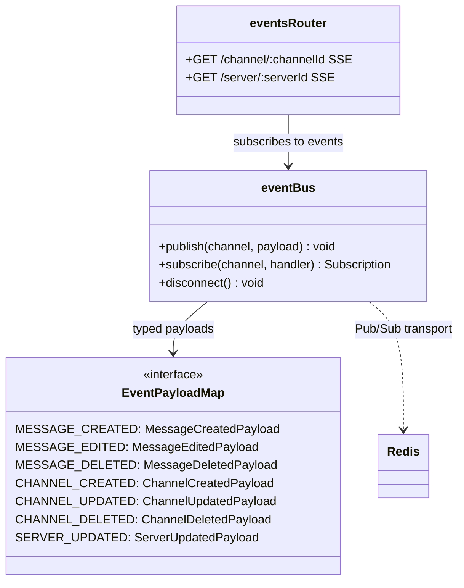
```mermaid
classDiagram
    class eventsRouter {
        +GET /channel/:channelId SSE
        +GET /server/:serverId SSE
    }

    class eventBus {
        +publish(channel, payload) void
        +subscribe(channel, handler) Subscription
        +disconnect() void
    }

    class EventPayloadMap {
        <<interface>>
        MESSAGE_CREATED: MessageCreatedPayload
        MESSAGE_EDITED: MessageEditedPayload
        MESSAGE_DELETED: MessageDeletedPayload
        CHANNEL_CREATED: ChannelCreatedPayload
        CHANNEL_UPDATED: ChannelUpdatedPayload
        CHANNEL_DELETED: ChannelDeletedPayload
        SERVER_UPDATED: ServerUpdatedPayload
    }

    eventsRouter --> eventBus : subscribes to events
    eventBus --> EventPayloadMap : typed payloads
    eventBus ..> Redis : Pub/Sub transport
```

### 8. Code Generation

Implementation code is located in:
- `backend/src/routes/events.router.ts`
- `backend/src/events/eventBus.ts`
- `backend/src/events/eventTypes.ts`

---

## Module 11: Permission System

### 1. Features

| Capability | Description |
|---|---|
| Role-based permissions | Maps each RoleType to a set of allowed actions. Higher roles inherit all permissions of lower roles. |
| Permission check | Given a userId, serverId, and action, returns whether the user is authorized. |
| Permission enforcement | `requirePermission` throws a tRPC FORBIDDEN error if the user lacks the required action. |
| System admin override | System admins (identified by email `admin@harmony.dev`) bypass all permission checks. |

**What it does not do:** Does not handle per-channel permissions, custom roles, or permission overrides.

### 2. Internal Architecture

```mermaid
flowchart TD
    Router -->|withPermission middleware| PermissionService
    PermissionService -->|lookup membership| Prisma[(PostgreSQL)]
    PermissionService -->|admin check| AdminUtils[isSystemAdmin]
    PermissionService -->|role → actions| RolePermissionMap
    RolePermissionMap -->|OWNER| AllActions
    RolePermissionMap -->|ADMIN| AdminActions
    RolePermissionMap -->|MODERATOR| ModActions
    RolePermissionMap -->|MEMBER| MemberActions
    RolePermissionMap -->|GUEST| GuestActions
```

**Design justification:** A static role→permission mapping is simpler and more auditable than a dynamic ACL system. The five-tier hierarchy covers the Discord-like use case without the complexity of custom roles. The `withPermission` tRPC middleware composition keeps permission checks declarative at the router level.

### 3. Data Abstraction

**Actions** are string literals grouped by domain:
- Server: `server:read`, `server:update`, `server:delete`, `server:manage_members`
- Channel: `channel:read`, `channel:create`, `channel:update`, `channel:delete`, `channel:manage_visibility`
- Message: `message:read`, `message:create`, `message:update_own`, `message:delete_own`, `message:delete_any`, `message:pin`, `message:react`
- Settings: `settings:read`, `settings:update`

Each role has a static `Set<Action>` that defines what it can do.

### 4. Stable Storage

The permission module reads from the `ServerMember` table to determine a user's role in a server. It does not have its own schema — role data is stored in the ServerMember model (see Module 6).

### 5. External API

This module has no direct external API. It is consumed internally by tRPC router middleware (`withPermission`) and by other services.

### 6. Class/Method/Field Declarations

```typescript
// ── Public ──────────────────────────────────────────────

export type ServerAction = 'server:read' | 'server:update' | 'server:delete' | 'server:manage_members';
export type ChannelAction = 'channel:read' | 'channel:create' | 'channel:update' | 'channel:delete' | 'channel:manage_visibility';
export type MessageAction = 'message:read' | 'message:create' | 'message:update_own' | 'message:delete_own' | 'message:delete_any' | 'message:pin' | 'message:react';
export type SettingsAction = 'settings:read' | 'settings:update';
export type Action = ServerAction | ChannelAction | MessageAction | SettingsAction;

export const permissionService = {
  getMemberRole(userId: string, serverId: string): Promise<RoleType | null>;
  checkPermission(userId: string, serverId: string, action: Action): Promise<boolean>;
  requirePermission(userId: string, serverId: string, action: Action): Promise<void>;
};

// ── Private ─────────────────────────────────────────────

const GUEST_PERMISSIONS: Set<Action>;
const MEMBER_PERMISSIONS: Set<Action>;
const MODERATOR_PERMISSIONS: Set<Action>;
const ADMIN_PERMISSIONS: Set<Action>;
const OWNER_PERMISSIONS: Set<Action>;
const ROLE_PERMISSIONS: Record<RoleType, Set<Action>>;
```

### 7. Class Hierarchy Diagram

```mermaid
classDiagram
    class permissionService {
        +getMemberRole(userId, serverId) RoleType
        +checkPermission(userId, serverId, action) boolean
        +requirePermission(userId, serverId, action) void
    }

    class Action {
        <<type>>
        ServerAction | ChannelAction | MessageAction | SettingsAction
    }

    class RolePermissionMap {
        OWNER: Set~Action~
        ADMIN: Set~Action~
        MODERATOR: Set~Action~
        MEMBER: Set~Action~
        GUEST: Set~Action~
    }

    permissionService --> RolePermissionMap : lookups
    permissionService --> Action : validates against
```

### 8. Code Generation

Implementation code is located in:
- `backend/src/services/permission.service.ts`
- `backend/src/lib/admin.utils.ts`

---

## Module 12: Message Reactions

### 1. Features

| Capability | Description |
|---|---|
| Add reaction | A member adds an emoji reaction to a message. Unique per `(messageId, userId, emoji)` — duplicate throws CONFLICT. Publishes `REACTION_ADDED` event. |
| Remove reaction | The reaction owner removes their emoji reaction. Throws FORBIDDEN if the emoji exists but belongs to another user; NOT_FOUND if no such emoji exists. Publishes `REACTION_REMOVED` event. |
| Get reactions | Returns all reactions for a message grouped by emoji: `{ emoji, count, userIds[] }[]`. |

**What it does not do:** Does not support animated emoji or custom server emoji. Does not cap the number of distinct emoji per message.

### 2. Internal Architecture

```mermaid
flowchart TD
    Client -->|tRPC call| ReactionRouter
    ReactionRouter -->|permission check| PermissionService
    ReactionRouter -->|business logic| ReactionService
    ReactionService -->|CRUD| Prisma[(PostgreSQL)]
    ReactionService -->|publish events| EventBus
    ReactionService -->|cache invalidation| CacheService[Redis]
    ReactionService -->|validate message ownership| requireMessageInServer
```

**Design justification:** The unique constraint `(messageId, userId, emoji)` is enforced at the database level so concurrent add attempts are safe without application-level locking. The FORBIDDEN vs NOT_FOUND distinction in `removeReaction` gives the caller meaningful feedback without requiring a separate "does this reaction exist?" query in the common path.

### 3. Data Abstraction

A **MessageReaction** records that a user placed a specific emoji on a message. Multiple users may react with the same emoji (each creating a separate row), but a given user may not react with the same emoji twice on the same message.

### 4. Stable Storage

```prisma
model MessageReaction {
  id        String   @id @default(uuid())
  messageId String
  userId    String
  emoji     String   @db.VarChar(100)
  createdAt DateTime @default(now())
  message   Message  @relation(fields: [messageId], references: [id], onDelete: Cascade)
  user      User     @relation(fields: [userId], references: [id], onDelete: Cascade)
  @@unique([messageId, userId, emoji])
  @@index([messageId])
  @@map("message_reactions")
}
```

### 5. External API

| Procedure | Type | Input | Permission |
|---|---|---|---|
| `reaction.addReaction` | mutation | `{ serverId, channelId, messageId, emoji }` | `message:react` |
| `reaction.removeReaction` | mutation | `{ serverId, channelId, messageId, emoji }` | `message:react` |
| `reaction.getReactions` | query | `{ serverId, channelId, messageId }` | `message:read` |

### 6. Class/Method/Field Declarations

```typescript
// ── Public ──────────────────────────────────────────────

export interface ReactionGroup {
  emoji: string;
  count: number;
  userIds: string[];
}

export const reactionService = {
  addReaction(input: AddReactionInput): Promise<MessageReaction>;
  removeReaction(input: RemoveReactionInput): Promise<void>;
  getMessageReactions(input: GetMessageReactionsInput): Promise<ReactionGroup[]>;
};
```

### 7. Code Generation

Implementation code is located in:
- `harmony-backend/src/services/reaction.service.ts`
- `harmony-backend/src/trpc/routers/reaction.router.ts`
