# Unified Backend Architecture — Harmony

> **Scope:** This document specifies the shared backend that powers all three P3 features—**Channel Visibility Toggle**, **Guest Public Channel View**, and **SEO Meta Tag Generation**—in a single, cohesive service layer. It is the authoritative reference for module boundaries, data models, APIs, and class ownership.

---

## 1. Design Rationale

### 1.1 Why a Unified Backend?

Each feature spec was authored independently and defines its own modules, classes, and schemas. Left unmerged, the codebase would contain three competing `ChannelRepository` classes, duplicate cache logic, and inconsistent database schemas. A unified backend eliminates this redundancy while preserving each feature's domain-specific logic.

### 1.2 Key Design Choices

| Decision | Choice | Justification |
|----------|--------|---------------|
| **Primary Language** | TypeScript 5.3+ | End-to-end type safety (client + server); single language reduces context-switching. |
| **Database** | PostgreSQL 16+ | ACID guarantees for visibility state transitions; native `ENUM` types for visibility; `JSONB` for flexible audit payloads; partial indexes for efficient public-channel queries. |
| **Cache / EventBus** | Redis 7.2+ | Sub-millisecond reads for visibility checks on every public page load; Pub/Sub for cross-module event propagation (`VISIBILITY_CHANGED`, `MESSAGE_CREATED`, etc.) without tight coupling. |
| **Authenticated APIs** | tRPC 11 | End-to-end type inference between Next.js client and Express server; eliminates hand-written API clients for admin operations. |
| **Public APIs** | REST (Express) | Search-engine crawlers, social-media link unfurlers, and CDN edge workers require plain HTTP. tRPC's binary protocol is invisible to these consumers. |
| **ORM** | Prisma 5.8+ | Type-safe schema definitions; auto-generated migrations; integrates with PostgreSQL enums. |
| **Runtime Validation** | Zod 3.22+ | Composes with tRPC for automatic request/response validation; shared between client and server. |
| **Job Queue** | BullMQ 5.0+ (backed by Redis) | Async meta-tag regeneration and sitemap rebuilds need durable, retryable jobs with exponential backoff. |
| **SSR Framework** | Next.js 14+ | Server-side rendering is critical for SEO; server components reduce client bundle for public pages. |
| **CDN** | CloudFlare | Edge caching for public pages; DDoS protection; bot detection at the edge before requests hit origin. |
| **HTML Sanitization** | DOMPurify 3.0+ | XSS prevention for user-generated content rendered on public pages. |

### 1.3 tRPC + REST Split

```
┌──────────────────────────────────────────────────────────────────┐
│                        API Surface                                │
├──────────────────────┬───────────────────────────────────────────┤
│   tRPC (Authenticated)│         REST (Public/Unauthenticated)     │
│                      │                                           │
│  • Channel settings  │  • GET /c/{server}/{channel}  (SSR page)  │
│  • Visibility toggle │  • GET /api/public/channels/…  (messages) │
│  • Audit log queries │  • GET /api/public/servers/…   (server)   │
│  • Admin meta-tag    │  • GET /sitemap/{server}.xml              │
│    overrides         │  • GET /robots.txt                        │
│                      │  • GET /s/{server}  (server landing)      │
└──────────────────────┴───────────────────────────────────────────┘
```

**Why the split?** Crawlers (Googlebot, Bingbot) and social-media unfurlers (Facebook, Twitter/X, Slack) make standard HTTP requests. They cannot consume tRPC. Admin operations (visibility toggling, meta-tag overrides) benefit from tRPC's type inference and are only used by authenticated Harmony clients.

---

## 2. System Architecture Overview

### 2.1 High-Level Architecture Diagram

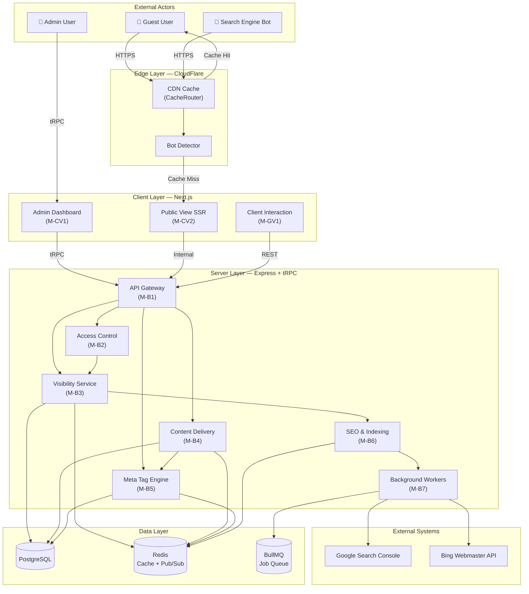

### 2.2 Module Map

The unified backend organizes into **shared backend modules** (prefixed `M-B`) and **data layer modules** (prefixed `M-D`). Client-layer modules are listed for reference only; they are specified in their respective feature dev specs.

| Module ID | Name | Layer | Feature Owner | Purpose |
|-----------|------|-------|---------------|---------|
| *M-CV1* | *Admin Dashboard* | *Client* | *Channel Visibility Toggle* | *Specified in [channel visibility spec](./dev-spec-channel-visibility-toggle.md)* |
| *M-CV2* | *Public Channel Viewer* | *Client* | *Channel Visibility Toggle* | *Specified in [channel visibility spec](./dev-spec-channel-visibility-toggle.md)* |
| *M-GV1* | *Public View (SSR)* | *Client* | *Guest Public Channel View* | *Specified in [guest public channel spec](./dev-spec-guest-public-channel-view.md)* |
| *M-GV2* | *Client Interaction* | *Client* | *Guest Public Channel View* | *Specified in [guest public channel spec](./dev-spec-guest-public-channel-view.md)* |
| M-B1 | API Gateway | Server | Shared | tRPC router (authenticated) + REST controllers (public) |
| M-B2 | Access Control | Server | Shared | Visibility guard, content filter, rate limiter, anonymous sessions |
| M-B3 | Visibility Management | Server | Channel Visibility Toggle | Visibility state machine, permission checks, audit logging |
| M-B4 | Content Delivery | Server | Guest Public Channel View | Message retrieval, author privacy, attachment processing |
| M-B5 | Meta Tag Engine | Server | SEO Meta Tag Generation | Meta tag generation, content analysis, OpenGraph, structured data |
| M-B6 | SEO & Indexing | Server | Shared | Sitemap generation, search engine notifications, canonical URLs, robots directives |
| M-B7 | Background Workers | Server | Shared | BullMQ workers for async meta-tag regeneration, sitemap rebuilds, search engine pings |
| M-D1 | Data Access | Data | Shared | Repositories (Channel, Message, Server, User, Attachment, AuditLog, MetaTag) |
| M-D2 | Persistence | Data | Shared | PostgreSQL schemas (all tables) |
| M-D3 | Cache | Data | Shared | Redis cache schemas and Pub/Sub event channels |

---

## 3. Unified Class Hierarchy

### 3.1 Class Diagram

```mermaid
classDiagram
    %% === Interfaces ===
    class IVisibilityToggle {
        <<interface>>
        +setVisibility(channelId, visibility, actorId, ip) VisibilityChangeResult
        +getVisibility(channelId) ChannelVisibility
        +canChangeVisibility(channelId, actorId) boolean
    }

    class IMetaTagGenerator {
        <<interface>>
        +generate(channelId) MetaTagSet
        +validate(tags) ValidationResult
    }

    %% === Enumerations ===
    class ChannelVisibility {
        <<enumeration>>
        PUBLIC_INDEXABLE
        PUBLIC_NO_INDEX
        PRIVATE
    }

    %% === Domain Entities ===
    class Channel {
        <<entity>>
        +id: UUID
        +serverId: UUID
        +name: string
        +slug: string
        +visibility: ChannelVisibility
        +topic: string?
        +position: number
        +indexedAt: DateTime?
        +createdAt: DateTime
        +updatedAt: DateTime
        +isPublic() boolean
        +isIndexable() boolean
    }

    class Server {
        <<entity>>
        +id: UUID
        +name: string
        +slug: string
        +description: string?
        +iconUrl: string?
        +isPublic: boolean
        +memberCount: number
        +createdAt: DateTime
    }

    class Message {
        <<entity>>
        +id: UUID
        +channelId: UUID
        +authorId: UUID
        +content: string
        +createdAt: DateTime
        +editedAt: DateTime?
        +isDeleted: boolean
    }

    class User {
        <<entity>>
        +id: UUID
        +username: string
        +displayName: string
        +avatarUrl: string?
        +publicProfile: boolean
        +createdAt: DateTime
    }

    class Attachment {
        <<entity>>
        +id: UUID
        +messageId: UUID
        +filename: string
        +url: string
        +contentType: string
        +sizeBytes: number
    }

    class AuditLogEntry {
        <<entity>>
        +id: UUID
        +channelId: UUID
        +actorId: UUID
        +action: string
        +oldValue: JSON
        +newValue: JSON
        +timestamp: DateTime
        +ipAddress: string
    }

    class GeneratedMetaTags {
        <<entity>>
        +id: UUID
        +channelId: UUID
        +title: string
        +description: string
        +ogTitle: string
        +ogDescription: string
        +ogImage: string?
        +twitterCard: string
        +keywords: string[]
        +structuredData: JSON
        +contentHash: string
        +needsRegeneration: boolean
        +generatedAt: DateTime
        +version: number
    }

    %% === Events ===
    class VisibilityChangeEvent {
        <<event>>
        +channelId: UUID
        +oldVisibility: ChannelVisibility
        +newVisibility: ChannelVisibility
        +actorId: UUID
        +timestamp: DateTime
    }

    %% === DTOs ===
    class PublicChannelDTO {
        <<DTO>>
        +id: string
        +name: string
        +slug: string
        +topic: string
        +messageCount: number
        +serverSlug: string
    }

    class PublicMessageDTO {
        <<DTO>>
        +id: string
        +content: string
        +author: PublicAuthorDTO
        +createdAt: string
        +editedAt: string?
        +attachments: PublicAttachmentDTO[]
    }

    class PublicAuthorDTO {
        <<DTO>>
        +displayName: string
        +avatarUrl: string?
    }

    class PublicServerDTO {
        <<DTO>>
        +name: string
        +slug: string
        +description: string?
        +iconUrl: string?
        +memberCount: number
        +publicChannelCount: number
    }

    class MetaTagSet {
        <<DTO>>
        +title: string
        +description: string
        +ogTags: OpenGraphTags
        +twitterCard: TwitterCardTags
        +structuredData: JSON
        +canonicalUrl: string
        +robots: string
    }

    class VisibilityUpdateRequest {
        <<DTO>>
        +visibility: ChannelVisibility
    }

    class VisibilityUpdateResponse {
        <<DTO>>
        +success: boolean
        +channel: PublicChannelDTO
        +previousVisibility: ChannelVisibility
        +indexingStatus: string
    }

    %% === Services (M-B3: Visibility Management) ===
    class ChannelVisibilityService {
        -channelRepository: ChannelRepository
        -auditLogger: AuditLogService
        -eventBus: EventBus
        -permissionService: PermissionService
        +setVisibility() VisibilityChangeResult
        +getVisibility() ChannelVisibility
        +canChangeVisibility() boolean
        -validateTransition() ValidationResult
        -emitVisibilityChange() void
    }

    class PermissionService {
        +canManageChannel(userId, channelId) boolean
        +isServerAdmin(userId, serverId) boolean
        +getEffectivePermissions(userId, channelId) PermissionSet
    }

    class AuditLogService {
        +logVisibilityChange(entry) void
        +getAuditHistory(channelId, options) AuditLogEntry[]
        +exportAuditLog(channelId, format) Buffer
    }

    %% === Services (M-B4: Content Delivery) ===
    class MessageService {
        -messageRepository: MessageRepository
        -contentFilter: ContentFilter
        +getMessagesForPublicView(channelId, page) PublicMessageDTO[]
        +getMessageById(messageId) PublicMessageDTO
        +buildMessageDTO(message) PublicMessageDTO
    }

    class AuthorService {
        -userRepository: UserRepository
        +getPublicAuthorInfo(userId) PublicAuthorDTO
        +anonymizeAuthor(user) PublicAuthorDTO
        +getDisplayName(user) string
    }

    class AttachmentService {
        -storageClient: StorageClient
        +getPublicAttachmentUrl(attachmentId) string
        +generateThumbnail(attachment) string
        +isAttachmentPublic(attachment) boolean
    }

    %% === Services (M-B5: Meta Tag Engine) ===
    class MetaTagService {
        +generateMetaTags(channelId) MetaTagSet
        +getOrGenerateCached(channelId) MetaTagSet
        +invalidateCache(channelId) void
        +scheduleRegeneration(channelId) void
    }

    class ContentAnalyzer {
        +analyzeThread(channelId) ContentAnalysis
        +getTopicCategory(messages) string
    }

    %% === Services (M-B6: SEO & Indexing) ===
    class IndexingService {
        -sitemapGenerator: SitemapGenerator
        +updateSitemap(serverId) void
        +notifySearchEngines(url, action) NotificationResult
        +generateCanonicalUrl(serverId, channelId) string
        +getRobotsDirectives(visibility) RobotsDirectives
    }

    class SitemapGenerator {
        -publicChannelRepo: ChannelRepository
        +generate(serverId) SitemapXML
        +getLastModified(serverId) DateTime
    }

    class SEOService {
        +generatePageTitle(channel, server) string
        +generateDescription(channel, messages) string
        +generateStructuredData(channel, messages) JSON
        +generateBreadcrumbs(server, channel) JSON
        +getCanonicalUrl(server, channel) string
    }

    %% === Access Control (M-B2) ===
    class VisibilityGuard {
        -channelRepository: ChannelRepository
        -cacheService: CacheClient
        +isChannelPublic(channelId) boolean
        +isServerPublic(serverId) boolean
        +getVisibilityStatus(channelId) ChannelVisibility
    }

    class ContentFilter {
        -sensitivePatterns: RegExp[]
        +filterSensitiveContent(content) string
        +redactUserMentions(content) string
        +sanitizeForDisplay(html) string
        +sanitizeAttachments(attachments) Attachment[]
    }

    class RateLimiter {
        -windowMs: number
        -maxRequests: number
        +checkLimit(key) boolean
        +incrementCounter(key) void
        +isRateLimited(key) boolean
    }

    %% === API Controllers (M-B1) ===
    class ChannelController {
        +getChannelSettings(channelId, ctx) ChannelSettingsResponse
        +updateChannelVisibility(channelId, body, ctx) VisibilityUpdateResponse
        +getVisibilityAuditLog(channelId, query, ctx) AuditLogResponse
        -validateAdminAccess(userId, channelId) boolean
    }

    class PublicChannelController {
        +getPublicChannelPage(serverSlug, channelSlug) PublicChannelPage
        +getPublicMessages(channelId, query) PublicMessagesResponse
        +getPublicMessage(channelId, messageId) PublicMessageDTO
    }

    class PublicServerController {
        +getPublicServerInfo(serverSlug) PublicServerDTO
        +getPublicChannelList(serverSlug) PublicChannelDTO[]
        +getServerLandingPage(serverSlug) ServerLandingPage
    }

    class SEOController {
        +getServerSitemap(serverSlug) SitemapXML
        +getRobotsTxt() RobotsTxt
    }

    %% === Repositories (M-D1) ===
    class ChannelRepository {
        +findById(channelId) Channel
        +findBySlug(serverSlug, channelSlug) Channel
        +update(channelId, data) Channel
        +findPublicByServerId(serverId) Channel[]
        +getVisibility(channelId) ChannelVisibility
        +getMetadata(channelId) ChannelMetadata
        -invalidateCache(channelId) void
        -getCacheKey(channelId) string
    }

    class MessageRepository {
        +findByChannelPaginated(channelId, page, limit) Message[]
        +findById(messageId) Message
        +countByChannel(channelId) number
    }

    class ServerRepository {
        +findBySlug(slug) Server
        +getPublicInfo(serverId) Server
    }

    class UserRepository {
        +findById(userId) User
        +getPublicProfile(userId) User
    }

    class AuditLogRepository {
        +create(entry) AuditLogEntry
        +findByChannelId(channelId, options) AuditLogEntry[]
        +findByDateRange(start, end) AuditLogEntry[]
    }

    class MetaTagRepository {
        +findByChannelId(channelId) GeneratedMetaTags
        +upsert(channelId, tags) GeneratedMetaTags
        +markForRegeneration(channelId) void
    }

    %% === Relationships ===
    IVisibilityToggle <|.. ChannelVisibilityService
    IMetaTagGenerator <|.. MetaTagService

    ChannelVisibilityService --> ChannelRepository
    ChannelVisibilityService --> AuditLogService
    ChannelVisibilityService --> PermissionService

    AuditLogService --> AuditLogRepository

    MessageService --> MessageRepository
    MessageService --> ContentFilter
    AuthorService --> UserRepository
    MetaTagService --> ContentAnalyzer
    MetaTagService --> MetaTagRepository
    MetaTagService --> ChannelRepository

    IndexingService --> SitemapGenerator
    SitemapGenerator --> ChannelRepository
    SEOService --> ChannelRepository
    SEOService --> MessageRepository

    VisibilityGuard --> ChannelRepository

    ChannelController --> ChannelVisibilityService
    ChannelController --> PermissionService
    PublicChannelController --> VisibilityGuard
    PublicChannelController --> MessageService
    PublicChannelController --> SEOService
    PublicServerController --> ServerRepository
    SEOController --> IndexingService

    Server "1" --> "*" Channel
    Channel "1" --> "*" Message
    Message "*" --> "1" User
    Message "1" --> "*" Attachment
    Channel "1" --> "*" AuditLogEntry
    Channel "1" --> "0..1" GeneratedMetaTags
```

### 3.2 Relationship Legend

| Symbol | Meaning |
|--------|---------|
| `<\|..` | Implements interface |
| `-->` | Depends on / uses |
| `"1" --> "*"` | One-to-many entity relationship |
| `"1" --> "0..1"` | One-to-zero-or-one entity relationship |

---

## 4. Unified Data Model

### 4.1 Database Schema (PostgreSQL)

```mermaid
erDiagram
    servers ||--o{ channels : "has"
    channels ||--o{ messages : "contains"
    channels ||--o{ visibility_audit_log : "tracks"
    channels ||--o| generated_meta_tags : "has"
    messages }o--|| users : "authored by"
    messages ||--o{ attachments : "has"

    servers {
        UUID id PK
        VARCHAR_100 name
        VARCHAR_100 slug UK
        TEXT description
        VARCHAR_500 icon_url
        BOOLEAN is_public
        INTEGER member_count
        TIMESTAMPTZ created_at
    }

    channels {
        UUID id PK
        UUID server_id FK
        VARCHAR_100 name
        VARCHAR_100 slug
        visibility_enum visibility
        TEXT topic
        INTEGER position
        TIMESTAMPTZ indexed_at
        TIMESTAMPTZ created_at
        TIMESTAMPTZ updated_at
    }

    messages {
        UUID id PK
        UUID channel_id FK
        UUID author_id FK
        TEXT content
        TIMESTAMPTZ created_at
        TIMESTAMPTZ edited_at
        BOOLEAN is_deleted
    }

    users {
        UUID id PK
        VARCHAR_32 username
        VARCHAR_100 display_name
        VARCHAR_500 avatar_url
        BOOLEAN public_profile
        TIMESTAMPTZ created_at
    }

    attachments {
        UUID id PK
        UUID message_id FK
        VARCHAR_255 filename
        VARCHAR_500 url
        VARCHAR_100 content_type
        BIGINT size_bytes
    }

    visibility_audit_log {
        UUID id PK
        UUID channel_id FK
        UUID actor_id FK
        VARCHAR_50 action
        JSONB old_value
        JSONB new_value
        TIMESTAMPTZ timestamp
        INET ip_address
        VARCHAR_500 user_agent
    }

    generated_meta_tags {
        UUID id PK
        UUID channel_id FK_UK
        VARCHAR_120 title
        VARCHAR_320 description
        VARCHAR_120 og_title
        VARCHAR_320 og_description
        VARCHAR_500 og_image
        VARCHAR_20 twitter_card
        TEXT_ARRAY keywords
        JSONB structured_data
        VARCHAR_64 content_hash
        BOOLEAN needs_regeneration
        TIMESTAMPTZ generated_at
        INTEGER version
    }
```

### 4.2 Enum Definition

```sql
CREATE TYPE visibility_enum AS ENUM ('PUBLIC_INDEXABLE', 'PUBLIC_NO_INDEX', 'PRIVATE');
```

### 4.3 Index Strategy (Canonical Set)

All indexes below are the **authoritative, merged** set across all three feature specs:

```sql
-- Channels
CREATE INDEX idx_channels_server_visibility ON channels(server_id, visibility);
CREATE UNIQUE INDEX idx_channels_server_slug ON channels(server_id, slug);
CREATE INDEX idx_channels_visibility_indexed ON channels(visibility, indexed_at)
  WHERE visibility = 'PUBLIC_INDEXABLE';
CREATE INDEX idx_channels_visibility ON channels(visibility)
  WHERE visibility IN ('PUBLIC_INDEXABLE', 'PUBLIC_NO_INDEX');

-- Messages
CREATE INDEX idx_messages_channel_time ON messages(channel_id, created_at DESC);
CREATE INDEX idx_messages_channel_not_deleted ON messages(channel_id, created_at DESC)
  WHERE is_deleted = FALSE;

-- Visibility Audit Log
CREATE INDEX idx_audit_channel_time ON visibility_audit_log(channel_id, timestamp DESC);
CREATE INDEX idx_audit_actor ON visibility_audit_log(actor_id, timestamp DESC);

-- Servers
CREATE UNIQUE INDEX idx_servers_slug ON servers(slug);
CREATE INDEX idx_servers_public ON servers(is_public) WHERE is_public = TRUE;

-- Generated Meta Tags
CREATE UNIQUE INDEX idx_meta_tags_channel ON generated_meta_tags(channel_id);
CREATE INDEX idx_meta_tags_needs_regen ON generated_meta_tags(needs_regeneration)
  WHERE needs_regeneration = TRUE;
```

### 4.4 Cache Schemas (Redis)

| Key Pattern | Value Type | TTL | Owner Module | Invalidation Trigger |
|-------------|-----------|-----|--------------|---------------------|
| `channel:{channelId}:visibility` | String (enum) | 3600s | M-B3 | `VISIBILITY_CHANGED` event |
| `server:{serverId}:public_channels` | JSON (channel ID array) | 300s | M-B4 | `VISIBILITY_CHANGED` event |
| `channel:msgs:{channelId}:page:{pageNum}` | JSON (PublicMessageDTO[]) | 60s | M-B4 | `MESSAGE_CREATED/EDITED/DELETED` |
| `server:{serverId}:info` | JSON (PublicServerDTO) | 300s | M-B4 | Server update |
| `guest:session:{sessionId}` | JSON (preferences) | 86400s | M-B2 | Session expiry |
| `meta:channel:{channelId}` | JSON (MetaTagSet) | 3600s | M-B5 | `VISIBILITY_CHANGED`, `MESSAGE_*` |
| `analysis:channel:{channelId}` | JSON (ContentAnalysis) | 1800s | M-B5 | `MESSAGE_*` events |

### 4.5 Event Bus (Redis Pub/Sub)

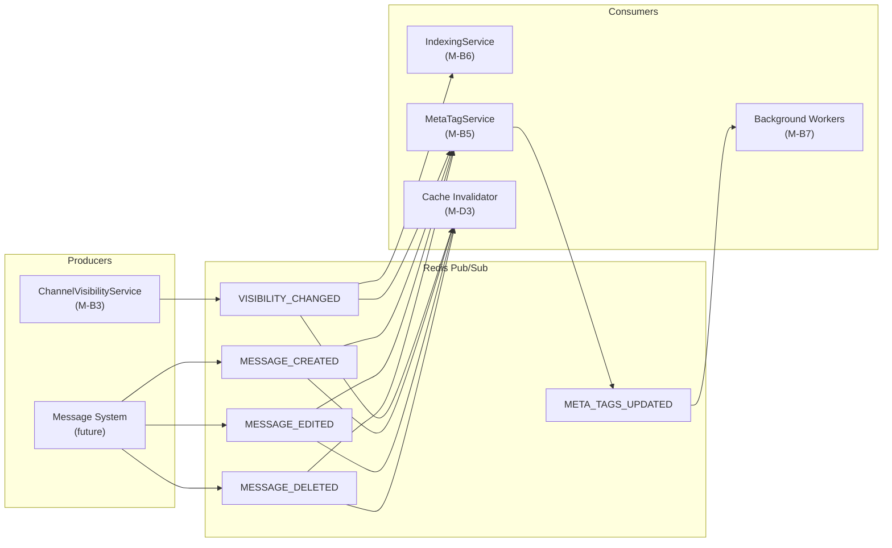

| Event | Payload | Producer | Consumers |
|-------|---------|----------|-----------|
| `VISIBILITY_CHANGED` | `{ channelId, oldVisibility, newVisibility, actorId, timestamp }` | ChannelVisibilityService (M-B3) | IndexingService (M-B6), MetaTagService (M-B5), Cache Invalidator (M-D3) |
| `MESSAGE_CREATED` | `{ messageId, channelId, authorId, timestamp }` | Message System | MetaTagService (M-B5), Cache Invalidator (M-D3) |
| `MESSAGE_EDITED` | `{ messageId, channelId, timestamp }` | Message System | MetaTagService (M-B5), Cache Invalidator (M-D3) |
| `MESSAGE_DELETED` | `{ messageId, channelId, timestamp }` | Message System | MetaTagService (M-B5), Cache Invalidator (M-D3) |
| `META_TAGS_UPDATED` | `{ channelId, version, timestamp }` | MetaTagService (M-B5) | Background Workers (M-B7) for sitemap update |

---

## 5. Unified API Surface

### 5.1 Authenticated APIs (tRPC)

All tRPC procedures are mounted under `/trpc` and require a valid session.

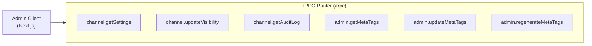

| Procedure | Input | Output | Feature |
|-----------|-------|--------|---------|
| `channel.getSettings` | `{ channelId: UUID }` | `ChannelSettingsResponse` | Channel Visibility Toggle |
| `channel.updateVisibility` | `{ channelId: UUID, visibility: ChannelVisibility }` | `VisibilityUpdateResponse` | Channel Visibility Toggle |
| `channel.getAuditLog` | `{ channelId: UUID, limit?, offset?, startDate? }` | `AuditLogResponse` | Channel Visibility Toggle |
| `admin.getMetaTags` | `{ channelId: UUID }` | `MetaTagSet` | SEO Meta Tag Generation |
| `admin.updateMetaTags` | `{ channelId: UUID, overrides: Partial<MetaTagSet> }` | `MetaTagSet` | SEO Meta Tag Generation |
| `admin.regenerateMetaTags` | `{ channelId: UUID }` | `{ jobId: string }` | SEO Meta Tag Generation |

### 5.2 Public APIs (REST)

All REST endpoints are unauthenticated. Rate limiting applies.

| Method | Path | Handler | Feature | Cache TTL |
|--------|------|---------|---------|-----------|
| GET | `/c/{serverSlug}/{channelSlug}` | `PublicChannelController.getPublicChannelPage` | Guest Public Channel View | 60s (CDN) |
| GET | `/api/public/channels/{channelId}/messages` | `PublicChannelController.getPublicMessages` | Guest Public Channel View | 60s |
| GET | `/api/public/channels/{channelId}/messages/{messageId}` | `PublicChannelController.getPublicMessage` | Guest Public Channel View | 60s |
| GET | `/api/public/servers/{serverSlug}` | `PublicServerController.getPublicServerInfo` | Guest Public Channel View | 300s |
| GET | `/api/public/servers/{serverSlug}/channels` | `PublicServerController.getPublicChannelList` | Guest Public Channel View | 300s |
| GET | `/s/{serverSlug}` | `PublicServerController.getServerLandingPage` | Guest Public Channel View | 300s (CDN) |
| GET | `/sitemap/{serverSlug}.xml` | `SEOController.getServerSitemap` | Channel Visibility Toggle | 3600s |
| GET | `/robots.txt` | `SEOController.getRobotsTxt` | Channel Visibility Toggle | 86400s |

### 5.3 Rate Limiting

| Consumer Type | Limit | Window | Scope |
|---------------|-------|--------|-------|
| Authenticated users | 100 req | 1 min | Per user |
| Guest users (anonymous) | 60 req | 1 min | Per IP |
| Verified bots (Googlebot, Bingbot) | 1000 req | 1 min | Per bot identity |

Exceeding limits returns `429 Too Many Requests` with a `Retry-After` header.

---

## 6. Per-Module Specifications

### 6.1 M-B1: API Gateway

**Purpose:** Single entry point for all backend requests. Routes authenticated traffic through tRPC and public traffic through REST controllers.

**Internal Architecture:**

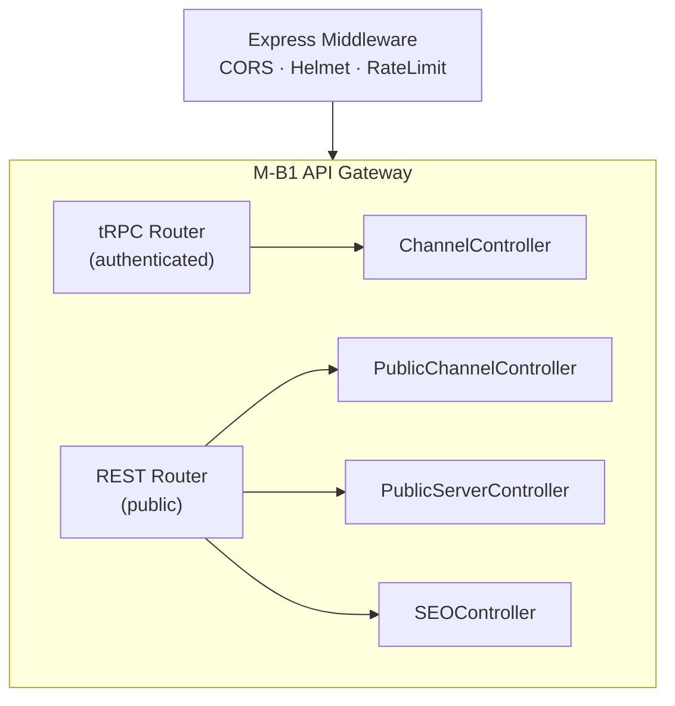

**Classes:**

| Label | Class | Visibility | Methods |
|-------|-------|------------|---------|
| CL-C-B1.1 | ChannelController | Public | `getChannelSettings()`, `updateChannelVisibility()`, `getVisibilityAuditLog()` |
| CL-C-B1.2 | PublicChannelController | Public | `getPublicChannelPage()`, `getPublicMessages()`, `getPublicMessage()` |
| CL-C-B1.3 | PublicServerController | Public | `getPublicServerInfo()`, `getPublicChannelList()`, `getServerLandingPage()` |
| CL-C-B1.4 | SEOController | Public | `getServerSitemap()`, `getRobotsTxt()` |

### 6.2 M-B2: Access Control

**Purpose:** Guards every public request: checks channel/server visibility, filters sensitive content from public output, enforces rate limits, and manages anonymous guest sessions.

**Internal Architecture:**

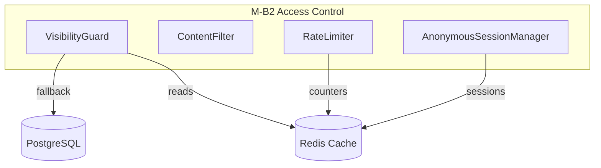

**Classes:**

| Label | Class | Visibility | Purpose |
|-------|-------|------------|---------|
| CL-C-B2.1 | VisibilityGuard | Public | Fast visibility checks (cache-first, DB fallback) |
| CL-C-B2.2 | ContentFilter | Public | Strips PII, redacts mentions, sanitizes HTML via DOMPurify |
| CL-C-B2.3 | RateLimiter | Public | Sliding-window rate limiting per IP/user/bot |
| CL-C-B2.4 | AnonymousSessionManager | Public | Cookie-based guest session with preferences |

### 6.3 M-B3: Visibility Management

**Purpose:** Owns the visibility state machine for channels. Only admins can toggle visibility. Every change is audited and emits an event to downstream consumers.

**Internal Architecture:**

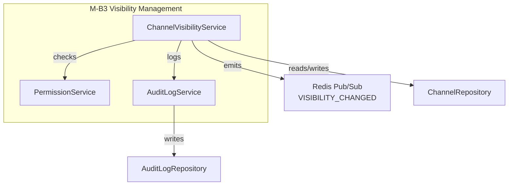

**State Machine:**

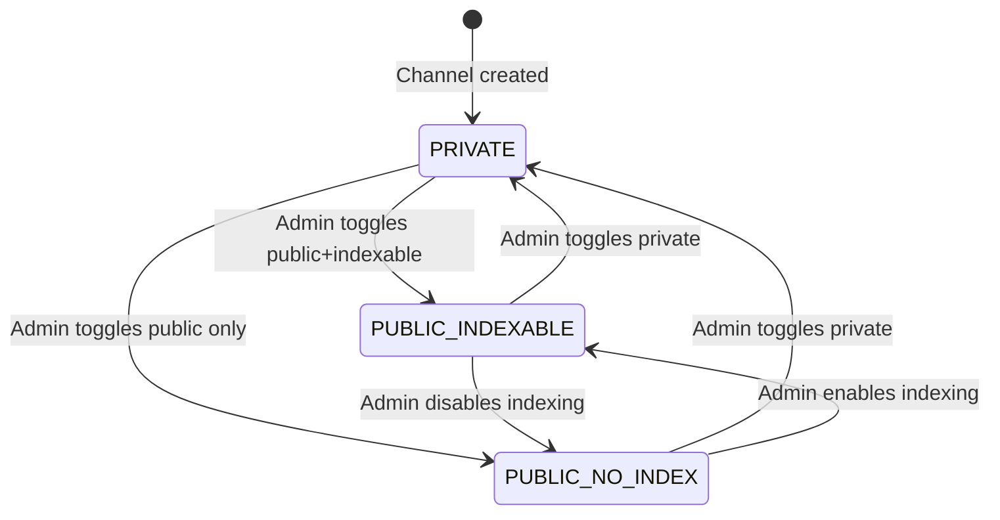

**Classes:**

| Label | Class | Visibility | Purpose |
|-------|-------|------------|---------|
| CL-C-B3.1 | ChannelVisibilityService | Public | Implements `IVisibilityToggle`; state transitions, validation, event emission |
| CL-C-B3.2 | PermissionService | Public | Checks admin/owner permissions before visibility changes |
| CL-C-B3.3 | AuditLogService | Public | Writes audit trail; queryable history; CSV/JSON export |

### 6.4 M-B4: Content Delivery

**Purpose:** Retrieves and formats channel content for public consumption. Handles author privacy (anonymization of opted-out users), attachment URL generation, and message pagination.

**Internal Architecture:**

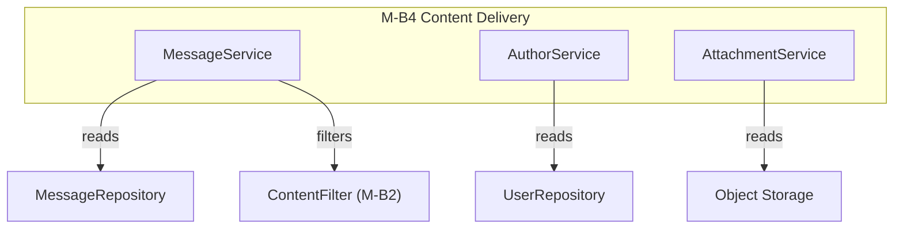

**Classes:**

| Label | Class | Visibility | Purpose |
|-------|-------|------------|---------|
| CL-C-B4.1 | MessageService | Public | Paginated message retrieval with content filtering |
| CL-C-B4.2 | AuthorService | Public | Author display names with privacy-respecting anonymization |
| CL-C-B4.3 | AttachmentService | Public | Public attachment URLs; thumbnail generation |

### 6.5 M-B5: Meta Tag Engine

**Purpose:** Generates SEO meta tags (title, description, OpenGraph, Twitter Card, JSON-LD structured data) for public channel pages. Uses NLP-based content analysis for keyword extraction and summarization.

**Internal Architecture:**

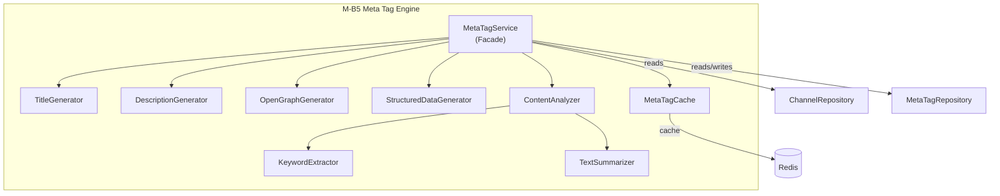

**Classes:**

| Label | Class | Visibility | Purpose |
|-------|-------|------------|---------|
| CL-C-B5.1 | MetaTagService | Public | Facade: orchestrates tag generation, caching, scheduling |
| CL-C-B5.2 | TitleGenerator | Internal | SEO-optimized titles from channel/message content |
| CL-C-B5.3 | DescriptionGenerator | Internal | Meta descriptions from message summarization |
| CL-C-B5.4 | OpenGraphGenerator | Internal | OG and Twitter Card tags |
| CL-C-B5.5 | StructuredDataGenerator | Internal | JSON-LD structured data (DiscussionForumPosting schema) |
| CL-C-B5.6 | MetaTagCache | Internal | Redis-backed cache for generated tags |
| CL-C-B5.7 | ContentAnalyzer | Public | NLP analysis: keywords, topics, summarization |
| CL-C-B5.8 | KeywordExtractor | Internal | TF-IDF keyword extraction via `natural` library |
| CL-C-B5.9 | TextSummarizer | Internal | Extractive summarization via `compromise` |

### 6.6 M-B6: SEO & Indexing

**Purpose:** Canonical owner of sitemap generation, `robots.txt` directives, canonical URLs, and search engine notification. Consumes `VISIBILITY_CHANGED` events to trigger sitemap rebuilds and indexing/de-indexing requests.

**Internal Architecture:**

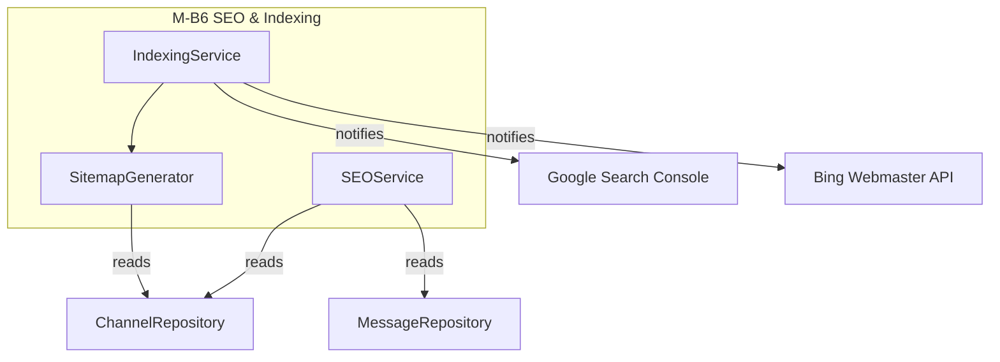

**Classes:**

| Label | Class | Visibility | Purpose |
|-------|-------|------------|---------|
| CL-C-B6.1 | IndexingService | Public | Sitemap updates; search engine ping; canonical URLs; robots directives |
| CL-C-B6.2 | SitemapGenerator | Internal | Builds XML sitemaps from public channel data |
| CL-C-B6.3 | SEOService | Public | Page titles, descriptions, breadcrumbs, canonical URLs for SSR |

### 6.7 M-B7: Background Workers

**Purpose:** Handles asynchronous, potentially expensive operations: meta-tag regeneration, sitemap rebuilds, and search engine notification. Uses BullMQ for durable, retryable job processing.

**Internal Architecture:**

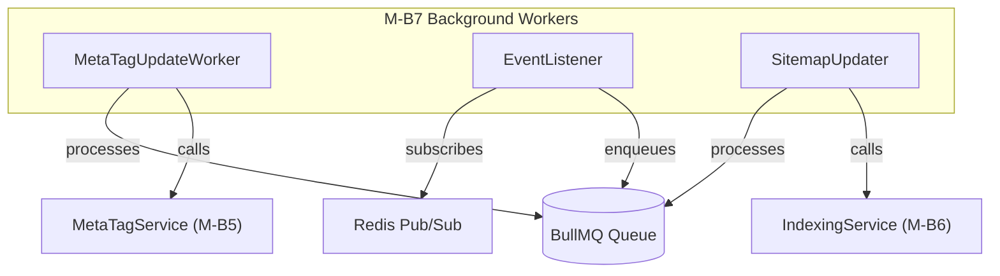

**Classes:**

| Label | Class | Visibility | Purpose |
|-------|-------|------------|---------|
| CL-C-B7.1 | MetaTagUpdateWorker | Internal | Processes meta-tag regeneration jobs |
| CL-C-B7.2 | EventListener | Internal | Subscribes to Redis Pub/Sub; routes events to job queues |
| CL-C-B7.3 | SitemapUpdater | Internal | Processes sitemap rebuild + search engine notification jobs |

### 6.8 M-D1: Data Access (Repositories)

**Purpose:** Provides a clean data abstraction layer over PostgreSQL (via Prisma) and Redis. All database queries are centralized here; no service directly accesses the database.

| Label | Class | Methods | Used By |
|-------|-------|---------|---------|
| CL-C-D1.1 | ChannelRepository | `findById`, `findBySlug`, `update`, `findPublicByServerId`, `getVisibility`, `getMetadata` | M-B3, M-B5, M-B6, M-B2 |
| CL-C-D1.2 | MessageRepository | `findByChannelPaginated`, `findById`, `countByChannel` | M-B4, M-B5 |
| CL-C-D1.3 | ServerRepository | `findBySlug`, `getPublicInfo` | M-B1 (PublicServerController) |
| CL-C-D1.4 | UserRepository | `findById`, `getPublicProfile` | M-B4 (AuthorService) |
| CL-C-D1.5 | AuditLogRepository | `create`, `findByChannelId`, `findByDateRange` | M-B3 (AuditLogService) |
| CL-C-D1.6 | MetaTagRepository | `findByChannelId`, `upsert`, `markForRegeneration` | M-B5 (MetaTagService) |

### 6.9 M-D2: Persistence (PostgreSQL)

**Purpose:** Owns all database table definitions, migrations, and enum types. Implemented as a Prisma schema that generates type-safe client code consumed by M-D1 repositories.

**Internal Architecture:**

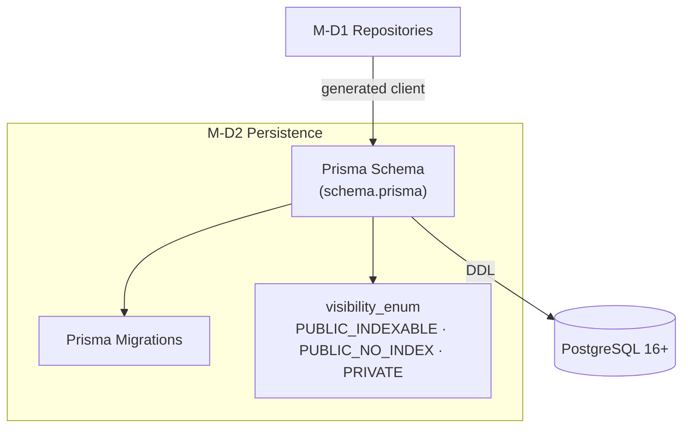

**Tables Managed:** `servers`, `channels`, `messages`, `users`, `attachments`, `visibility_audit_log`, `generated_meta_tags` (see §4 for full column definitions).

### 6.10 M-D3: Cache & EventBus (Redis)

**Purpose:** Manages all Redis cache keys, TTL policies, cache invalidation logic, and the Pub/Sub event bus transport. Provides a unified `CacheClient` and `EventBus` abstraction consumed by all service modules.

**Internal Architecture:**

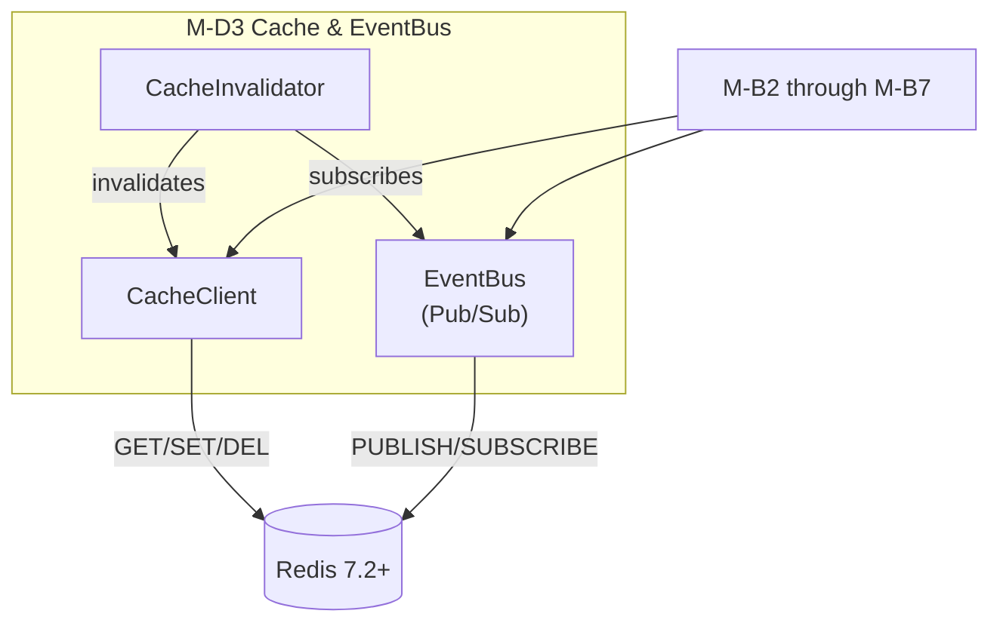

**Cache Key Ownership:** See §4.4 for the complete cache schema table with key patterns, TTLs, and invalidation triggers.

---

## 7. Cross-Feature Integration

### 7.1 Visibility Change Propagation

When an admin changes a channel's visibility, the system propagates the change across all features:

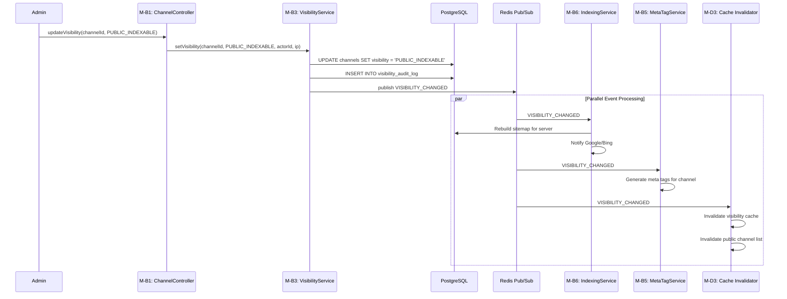

### 7.2 Guest Page Load (Cache Miss)

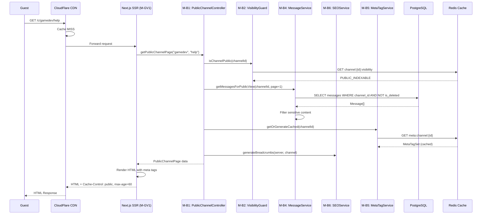

---

## 8. Technology Stack (Unified)

| Label | Technology | Version | Purpose | Used By |
|-------|------------|---------|---------|---------|
| T1 | TypeScript | 5.3+ | Primary language | All |
| T2 | React | 18.2+ | Frontend UI framework | M-CV1, M-CV2, M-GV1 |
| T3 | Next.js | 14.0+ | SSR framework | M-GV1, M-CV2 |
| T4 | Node.js | 20 LTS | Server runtime | All backend |
| T5 | PostgreSQL | 16+ | Primary database | M-D2 |
| T6 | Redis | 7.2+ | Cache, Pub/Sub EventBus, sessions | M-D3, M-B7 |
| T7 | Prisma | 5.8+ | Type-safe ORM | M-D1 |
| T8 | tRPC | 11+ | Authenticated type-safe APIs | M-B1 |
| T9 | Zod | 3.22+ | Runtime schema validation | All API layers |
| T10 | TailwindCSS | 3.4+ | Utility-first CSS | M-CV1, M-GV1 |
| T11 | CloudFlare | N/A | CDN, DDoS protection, edge cache | Edge layer |
| T12 | Docker | 24+ | Containerization | Deployment |
| T13 | Google Search Console API | v1 | Programmatic indexing/de-indexing | M-B6 |
| T14 | Bing Webmaster API | v1 | Microsoft search engine integration | M-B6 |
| T15 | Jest | 29+ | Unit/integration testing | All |
| T16 | Playwright | 1.40+ | E2E testing | All |
| T17 | DOMPurify | 3.0+ | HTML sanitization (XSS prevention) | M-B2, M-B5 |
| T18 | BullMQ | 5.0+ | Durable job queue | M-B7 |
| T19 | natural | 6.0+ | NLP keyword extraction | M-B5 |
| T20 | compromise | 14.0+ | NLP text parsing/summarization | M-B5 |
| T21 | schema-dts | 1.1+ | Typed JSON-LD structured data | M-B5, M-B6 |
| T22 | sharp | 0.33+ | Image processing/thumbnails | M-B4 |
| T23 | intersection-observer | polyfill | Infinite scroll (client) | M-GV2 |
| T24 | Lighthouse CI | 11+ | Performance testing | CI/CD |

---

## 9. Security Considerations

### 9.1 Content Filtering Pipeline

All user-generated content passes through `ContentFilter` (M-B2) before public rendering:

1. **DOMPurify** strips all script tags and event handlers
2. **Mention redaction** replaces `@username` with `@user` to protect identities
3. **PII detection** regex-based removal of email addresses, phone numbers
4. **Attachment filtering** removes non-public attachments from responses

### 9.2 Privacy Controls

- Users with `public_profile = false` are displayed as "Anonymous" with no avatar
- User database IDs are never exposed in public API responses
- Guest sessions use opaque session IDs; no PII is stored

### 9.3 Rate Limiting & Bot Protection

- CloudFlare DDoS protection at the edge layer
- Application-level sliding-window rate limiting (see §5.3)
- CAPTCHA challenge after 500 views/hour from a single IP (via CloudFlare)
- Verified bot allowlist: Googlebot, Bingbot, Slackbot (by User-Agent + reverse DNS)

### 9.4 Security Headers

All responses include:
- `Content-Security-Policy` — restricts script sources
- `X-Content-Type-Options: nosniff`
- `X-Frame-Options: DENY`
- `Strict-Transport-Security: max-age=31536000`
- `X-Robots-Tag` — dynamic per visibility (`index,follow` / `noindex,follow` / absent for private)

---

## 10. Mapping to Feature Specs

This section maps the unified backend modules back to the class labels used in each individual dev spec, providing a crosswalk for developers.

### 10.1 Channel Visibility Toggle Spec → Unified Backend

| Original Spec Label | Original Class | Unified Module | Unified Label |
|---------------------|----------------|----------------|---------------|
| CL-C4.1 | ChannelController | M-B1 | CL-C-B1.1 |
| CL-C4.2 | PublicAccessController | M-B1 | CL-C-B1.2 + CL-C-B1.4 |
| CL-C5.1 | ChannelVisibilityService | M-B3 | CL-C-B3.1 |
| CL-C5.2 | IndexingService | M-B6 | CL-C-B6.1 |
| CL-C5.3 | PermissionService | M-B3 | CL-C-B3.2 |
| CL-C5.4 | AuditLogService | M-B3 | CL-C-B3.3 |
| CL-C6.1 | ChannelRepository | M-D1 | CL-C-D1.1 |
| CL-C6.2 | AuditLogRepository | M-D1 | CL-C-D1.5 |

### 10.2 Guest Public Channel View Spec → Unified Backend

| Original Spec Label | Original Class | Unified Module | Unified Label |
|---------------------|----------------|----------------|---------------|
| CL-C3.1 | PublicChannelController | M-B1 | CL-C-B1.2 |
| CL-C3.2 | PublicServerController | M-B1 | CL-C-B1.3 |
| CL-C4.1 | VisibilityGuard | M-B2 | CL-C-B2.1 |
| CL-C4.2 | ContentFilter | M-B2 | CL-C-B2.2 |
| CL-C4.3 | RateLimiter | M-B2 | CL-C-B2.3 |
| CL-C4.4 | AnonymousSessionManager | M-B2 | CL-C-B2.4 |
| CL-C5.1 | MessageService | M-B4 | CL-C-B4.1 |
| CL-C5.2 | AuthorService | M-B4 | CL-C-B4.2 |
| CL-C5.3 | AttachmentService | M-B4 | CL-C-B4.3 |
| CL-C5.4 | SEOService | M-B6 | CL-C-B6.3 |
| CL-C6.1 | ChannelRepository | M-D1 | CL-C-D1.1 |
| CL-C6.2 | MessageRepository | M-D1 | CL-C-D1.2 |
| CL-C6.3 | ServerRepository | M-D1 | CL-C-D1.3 |
| CL-C6.4 | UserRepository | M-D1 | CL-C-D1.4 |

### 10.3 SEO Meta Tag Generation Spec → Unified Backend

| Original Spec Label | Original Class | Unified Module | Unified Label |
|---------------------|----------------|----------------|---------------|
| CL-C2.1 | MetaTagService | M-B5 | CL-C-B5.1 |
| CL-C2.2 | TitleGenerator | M-B5 | CL-C-B5.2 |
| CL-C2.3 | DescriptionGenerator | M-B5 | CL-C-B5.3 |
| CL-C2.4 | OpenGraphGenerator | M-B5 | CL-C-B5.4 |
| CL-C2.5 | StructuredDataGenerator | M-B5 | CL-C-B5.5 |
| CL-C2.6 | MetaTagCache | M-B5 | CL-C-B5.6 |
| CL-C3.1 | ContentAnalyzer | M-B5 | CL-C-B5.7 |
| CL-C3.2 | KeywordExtractor | M-B5 | CL-C-B5.8 |
| CL-C3.3 | TextSummarizer | M-B5 | CL-C-B5.9 |
| CL-C3.4 | TopicClassifier | M-B5 | CL-C-B5.7 (consolidated into ContentAnalyzer) |
| CL-C4.1 | MetaTagUpdateWorker | M-B7 | CL-C-B7.1 |
| CL-C4.2 | EventListener | M-B7 | CL-C-B7.2 |
| CL-C4.3 | SitemapUpdater | M-B7 | CL-C-B7.3 |
| CL-C5.1 | ChannelRepository | M-D1 | CL-C-D1.1 |
| CL-C5.2 | MessageRepository | M-D1 | CL-C-D1.2 |
| CL-C5.3 | MetaTagRepository | M-D1 | CL-C-D1.6 |

---

## Appendix A: Glossary

| Term | Definition |
|------|-----------|
| **PUBLIC_INDEXABLE** | Channel is publicly visible and should appear in search engine results |
| **PUBLIC_NO_INDEX** | Channel is publicly visible but has `noindex` robots directive |
| **PRIVATE** | Channel is not publicly accessible; requires authentication |
| **SSR** | Server-Side Rendering — HTML generated on the server for SEO |
| **tRPC** | TypeScript Remote Procedure Call — type-safe API framework |
| **EventBus** | Redis Pub/Sub messaging system for cross-module communication |
| **BullMQ** | Redis-backed job queue for background processing |
| **Prisma** | Type-safe ORM for PostgreSQL |

## Appendix B: File Structure (Planned)

```
harmony-backend/
├── src/
│   ├── index.ts                    # Server entry point
│   ├── app.ts                      # Express app factory
│   ├── lambda.ts                   # AWS Lambda wrapper
│   ├── middleware/
│   │   ├── cors.ts
│   │   ├── rateLimiter.ts          # M-B2: RateLimiter
│   │   └── helmet.ts
│   ├── trpc/
│   │   ├── init.ts
│   │   ├── router.ts               # Root tRPC router
│   │   ├── channel.router.ts       # M-B1: ChannelController procedures
│   │   └── admin.router.ts         # M-B1: Admin meta-tag procedures
│   ├── controllers/
│   │   ├── publicChannel.ctrl.ts   # M-B1: PublicChannelController
│   │   ├── publicServer.ctrl.ts    # M-B1: PublicServerController
│   │   └── seo.ctrl.ts             # M-B1: SEOController
│   ├── services/
│   │   ├── visibility.service.ts   # M-B3: ChannelVisibilityService
│   │   ├── permission.service.ts   # M-B3: PermissionService
│   │   ├── auditLog.service.ts     # M-B3: AuditLogService
│   │   ├── message.service.ts      # M-B4: MessageService
│   │   ├── author.service.ts       # M-B4: AuthorService
│   │   ├── attachment.service.ts   # M-B4: AttachmentService
│   │   ├── metaTag.service.ts      # M-B5: MetaTagService
│   │   ├── contentAnalyzer.ts      # M-B5: ContentAnalyzer
│   │   ├── indexing.service.ts     # M-B6: IndexingService
│   │   └── seo.service.ts          # M-B6: SEOService
│   ├── guards/
│   │   ├── visibilityGuard.ts      # M-B2: VisibilityGuard
│   │   ├── contentFilter.ts        # M-B2: ContentFilter
│   │   └── anonymousSession.ts     # M-B2: AnonymousSessionManager
│   ├── workers/
│   │   ├── metaTagUpdate.worker.ts # M-B7: MetaTagUpdateWorker
│   │   ├── eventListener.ts        # M-B7: EventListener
│   │   └── sitemapUpdater.ts       # M-B7: SitemapUpdater
│   ├── repositories/
│   │   ├── channel.repo.ts         # M-D1: ChannelRepository
│   │   ├── message.repo.ts         # M-D1: MessageRepository
│   │   ├── server.repo.ts          # M-D1: ServerRepository
│   │   ├── user.repo.ts            # M-D1: UserRepository
│   │   ├── auditLog.repo.ts        # M-D1: AuditLogRepository
│   │   └── metaTag.repo.ts         # M-D1: MetaTagRepository
│   ├── entities/
│   │   ├── channel.entity.ts
│   │   ├── message.entity.ts
│   │   ├── server.entity.ts
│   │   ├── user.entity.ts
│   │   ├── attachment.entity.ts
│   │   └── auditLogEntry.entity.ts
│   ├── dto/
│   │   ├── publicChannel.dto.ts
│   │   ├── publicMessage.dto.ts
│   │   ├── publicAuthor.dto.ts
│   │   ├── publicServer.dto.ts
│   │   ├── visibilityUpdate.dto.ts
│   │   └── metaTagSet.dto.ts
│   └── events/
│       ├── eventBus.ts             # Redis Pub/Sub wrapper
│       └── eventTypes.ts           # Event type definitions
├── prisma/
│   └── schema.prisma               # M-D2: Database schema
└── tests/
```

## Appendix C: References

- [Channel Visibility Toggle Dev Spec](./dev-spec-channel-visibility-toggle.md)
- [Guest Public Channel View Dev Spec](./dev-spec-guest-public-channel-view.md)
- [SEO Meta Tag Generation Dev Spec](./dev-spec-seo-meta-tag-generation.md)
